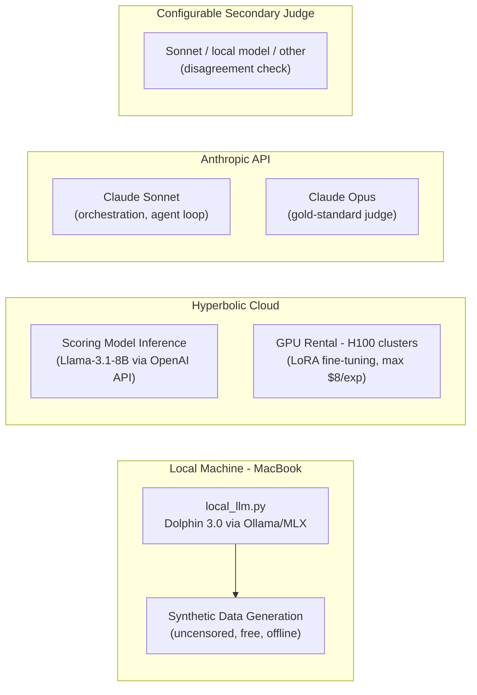
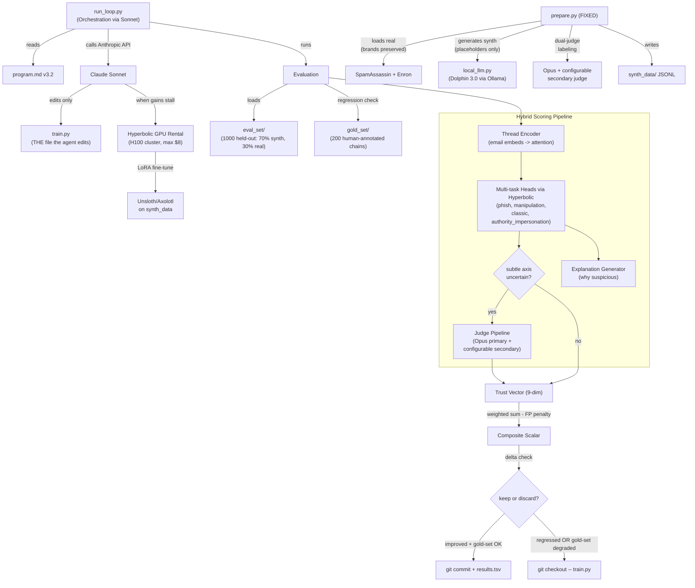

# AutoEmailTrust v3.2 Implementation Plan

Updates from v3.1: (1) Hyperbolic scoped to scoring model inference + GPU rental for training only, (2) new `local_llm.py` for synthetic data generation via Ollama/MLX (Dolphin 3.0, uncensored, free, offline), (3) LLM-as-judge is Opus via Anthropic API only with configurable secondary, (4) human annotation workflow as pre-build calibration step for judge quality.

## Infrastructure Boundaries



**Rule**: Each service does exactly one job. No bleed-through.

| Role | Service | Rationale |
|------|---------|-----------|
| Synthetic data gen | Local Ollama/MLX (Dolphin 3.0) | Free, uncensored, no API deps, iterate offline |
| Scoring model inference | Hyperbolic (OpenAI-compatible) | Configurable model, serves fine-tuned checkpoints |
| LoRA fine-tuning | Hyperbolic GPU rental (H100) | On-demand compute, auto-terminate at budget |
| Orchestration | Anthropic Sonnet | Drives the autoresearch loop via tool-use |
| Gold-standard judge | Anthropic Opus | Highest quality, calibrated against human annotations |
| Secondary judge | Configurable | Sonnet, local model, or other -- for disagreement filtering |

## Architecture Overview



## File Structure

```
autoresearch-helpful/
├── pyproject.toml           # uv project config, all deps
├── .env.example             # template for API keys
├── .env                     # (gitignored) actual keys
├── .gitignore
├── README.md                # updated with v3.2 architecture + quickstart
├── program.md               # v3.2 agent instruction set
├── run_loop.py              # orchestration: Anthropic Sonnet -> edit -> eval -> git
├── prepare.py               # FIXED: real corpora + local LLM synthetic generator
├── train.py                 # ONLY file the agent edits (thread-aware scorer + LoRA)
├── local_llm.py             # NEW: Ollama/MLX wrapper for synth data gen
├── hyperbolic_utils.py      # scoring model inference + GPU rental (NO synth gen)
├── judge_rubric.py           # Opus primary + configurable secondary judge
├── annotation_rubric.md     # NEW: human annotation guidelines for gold set
├── gold_set/                # NEW: 200 human-annotated chains (calibration)
│   └── gold_chains.jsonl
├── eval_set/                # 1,000 held-out chains (70% synth + 30% real)
│   └── eval_chains.jsonl
├── synth_data/              # generated synthetic training data
│   └── .gitkeep
└── results.tsv              # auto-logged experiment results
```

## What Changed from v3.1 to v3.2

### Change 1: Hyperbolic Scoped to Scoring + Training Only
- `hyperbolic_utils.py` **loses**: all synthetic data generation, judge inference
- `hyperbolic_utils.py` **keeps**: scoring model inference (OpenAI-compatible endpoint for Llama-3.1-8B), GPU rental for LoRA fine-tuning, BudgetGuard, YaRN helper
- Rationale: Hyperbolic is compute infrastructure, not a content generation service

### Change 2: New `local_llm.py` for Synthetic Data Generation
- Wraps Ollama (or MLX) for running Dolphin 3.0 locally on MacBook
- Uncensored model, free inference, no API dependencies, iterate on prompt templates offline
- `prepare.py` calls `local_llm` instead of Hyperbolic for all data generation
- No guardrail friction from API providers -- critical for generating realistic structural malicious examples

### Change 3: Judge = Opus Only (with Configurable Secondary)
- Primary judge: Claude Opus via direct Anthropic API calls. Gold standard.
- Secondary judge: configurable (Sonnet, local model via Ollama, or other). Used for disagreement filtering.
- `judge_rubric.py` no longer calls Hyperbolic 405B
- Self-enhancement bias mitigation now comes from model diversity (Opus vs different secondary) rather than Opus vs 405B

### Change 4: Human Annotation Workflow (Gold Set)
- **Pre-build step** before the autoresearch loop can run
- Generate 200 diverse email chains (mix of real SpamAssassin/Enron + synthetic from Dolphin)
- Define `annotation_rubric.md` with clear scoring guidelines for all 9 trust axes
- Have 2-3 annotators score each chain independently
- Compute inter-annotator agreement (Cohen's Kappa) per axis
- Measure Opus judge correlation with human consensus per axis
- Any axis with Opus-human Kappa < 0.7 is flagged as unreliable for automated eval -- those axes require human spot-checking in the loop
- Gold set serves as regression test: if autoresearch improves composite but degrades gold-set agreement on any axis, the change is rejected

## Implementation Details

### 1. Project Setup (`pyproject.toml`, `.env.example`, `.gitignore`)

- **`pyproject.toml`**: Python 3.12, managed by uv. Dependencies:
  - `anthropic` (Sonnet for orchestration, Opus for judge)
  - `openai` (Hyperbolic scoring model inference, OpenAI-compatible)
  - `ollama` (local LLM wrapper for synth data gen)
  - `python-dotenv` (load `.env`)
  - `GitPython` (programmatic git keep/discard)
  - `httpx` (Hyperbolic Marketplace API for GPU rental)
  - `rich` (logging + experiment output)
  - `datasets` (loading SpamAssassin / Enron corpora from HuggingFace)
  - `scikit-learn` (F1 score, classification metrics, Cohen's Kappa)
  - Dev deps: `pytest`, `ruff`
- **`.env.example`**: `ANTHROPIC_API_KEY=`, `HYPERBOLIC_API_KEY=`, `OLLAMA_MODEL=dolphin3:latest`
- **`.gitignore`**: `.env`, `synth_data/*.jsonl`, `__pycache__/`, `.venv/`, `results.tsv`

### 2. `local_llm.py` -- Local Inference for Synthetic Data (NEW)

Wraps Ollama (primary) and MLX (fallback) for running uncensored models locally:

- `LocalLLM` class:
  - `__init__(model="dolphin3:latest", backend="ollama")` -- configurable model and backend
  - `generate(prompt, temperature=0.8, max_tokens=4096)` -- single completion
  - `generate_batch(prompts, concurrency=4)` -- parallel local generation
  - `check_available()` -- verify Ollama is running and model is pulled
- Uses the `ollama` Python package for Ollama backend
- MLX fallback for Apple Silicon native inference (optional)
- No API keys required, no per-token cost, no content filtering

### 3. `hyperbolic_utils.py` -- Scoring Inference + GPU Rental

Scoped down from v3.1. Two sections only:

**A. Scoring Model Inference (OpenAI-compatible)**
- `get_inference_client()` -- returns `openai.OpenAI` configured with Hyperbolic base URL and key
- `score_completion(prompt, model="meta-llama/Llama-3.1-8B-Instruct", ...)` -- wrapper with retry logic for the scoring model
- `score_batch(prompts, ...)` -- concurrent batch scoring via asyncio
- Can serve fine-tuned model checkpoints after LoRA training

**B. GPU Rental for Training (Marketplace API via httpx)**
- `list_available_gpus(gpu_type="H100")` -- `GET /v1/marketplace`
- `rent_gpu(cluster_id, hours, name)` -- `POST /v1/marketplace/instances`
- `stop_gpu(instance_id)` -- terminate instance
- `get_gpu_status(instance_id)` -- check running/cost
- `run_remote_command(instance_id, command)` -- SSH exec wrapper
- `BudgetGuard` context manager -- tracks spend, auto-terminates at $8 limit
- `yarn_extend_context(base_model, target_ctx_len, finetune_steps=400)` -- YaRN config for rented GPU

**NOT in this file**: synthetic data generation (that's `local_llm.py`), judge calls (that's `judge_rubric.py` via Anthropic API)

### 4. `judge_rubric.py` -- Opus Primary + Configurable Secondary

Judges via Anthropic API only (no Hyperbolic inference):

- `JudgeRubric` class:
  - `__init__(primary_model="claude-opus-4-20250514", secondary_model="claude-sonnet-4-20250514")` -- configurable model pairing
  - `judge_chain(chain, axes=["subtle_toxicity", "deceit", "polarization", "vulnerability_risk", "authority_impersonation"])` -- Opus primary judge, returns per-axis scores with rationale
  - `should_escalate(fast_scores: dict, threshold=0.6)` -- determines if fast scorer output needs judge review
  - `dual_judge_label(chain)` -- Opus scores -> adversarial generator -> secondary judge independently scores -> disagreement filter
  - `disagreement_filter(scores1, scores2, max_divergence=0.2)` -- True if judges agree, False to discard
  - `calibrate_against_gold(gold_set_path)` -- computes per-axis Opus-human Kappa, flags unreliable axes (Kappa < 0.7)
  - `gold_set_regression_check(predictions, gold_set_path)` -- returns True if no axis degrades vs human labels
- **Bias mitigations** (baked into prompt construction):
  - Position bias: randomize presentation order of email messages
  - Verbosity bias: instruct judge to score based on substance not length
  - Self-enhancement bias: primary and secondary are different models (Opus vs Sonnet/local)
- Uses direct `anthropic` client for both primary and secondary (or `local_llm` for local secondary)
- Returns structured JSON matching the 9-dim trust vector schema

### 5. `annotation_rubric.md` + Gold Set Workflow (NEW)

**Pre-build calibration step.** Must complete before the autoresearch loop runs.

**A. `annotation_rubric.md`** -- human annotation guidelines:
- Clear definitions for each of the 9 trust axes with examples at 0.0, 0.5, and 1.0
- Specific decision criteria for binary axes (phish, verify_by_search_flag)
- Edge case guidance (e.g., legitimate urgency vs manipulative urgency)
- Instructions for handling ambiguous chains

**B. Gold set generation workflow:**
1. Generate 200 diverse chains: ~60 from SpamAssassin, ~60 from Enron threads, ~80 synthetic from Dolphin 3.0
2. Export to annotation format (chain + blank scoring sheet per axis)
3. 2-3 annotators independently score each chain on all 9 axes using the rubric
4. Compute inter-annotator agreement (Cohen's Kappa) per axis
5. Resolve disagreements via discussion for consensus labels
6. Save to `gold_set/gold_chains.jsonl` with consensus labels + per-annotator raw scores
7. Run `judge_rubric.calibrate_against_gold()` to measure Opus alignment per axis
8. Any axis with Kappa < 0.7 is flagged -- those axes require human spot-checking during autoresearch

**Gold set schema (extends base chain schema):**
```python
{
    ...base chain fields...,
    "annotator_scores": {
        "annotator_1": {"phish": 1, "truthfulness": 0.3, ...},
        "annotator_2": {"phish": 1, "truthfulness": 0.4, ...},
        "annotator_3": {"phish": 1, "truthfulness": 0.35, ...}
    },
    "consensus_labels": {"phish": 1, "truthfulness": 0.35, ...},
    "inter_annotator_kappa": {"phish": 0.85, "truthfulness": 0.72, ...},
    "opus_agreement": {"phish": 0.92, "truthfulness": 0.78, ...}
}
```

### 6. `prepare.py` -- Data Pipeline (FIXED, never edited by agent)

Two data sources with hybrid safety and dual-judge labeling. **Now calls `local_llm.py` for generation, not Hyperbolic.**

**A. Real Corpora Loader (real brands preserved)**
- `load_spamassassin()` -- downloads SpamAssassin public corpus, parses into email chain format. Real brand names kept as-is
- `load_enron_threads()` -- loads Enron email dataset, filters to multi-message chains. Real names/companies preserved
- Labels real emails using `judge_rubric.judge_chain()` (Opus) for ground truth on all 9 axes

**B. Synthetic Generator (via local_llm, placeholders only, no operational instructions)**
1. Generate 150-200 seed threads using `local_llm.generate()` (Dolphin 3.0 via Ollama) -- benign + structural malicious
2. **Safety filter**: reject examples containing operational phishing instructions. Real brand names replaced with placeholders in synthetic data only
3. Evol-Instruct (4 epochs): progressively increase complexity using `local_llm` for each iteration
4. SpearBot-style critic loop: generate -> critic (local) evaluates detectability -> refine until subtle
5. **Dual-judge labeling**: Opus primary scores -> adversarial generator (local) -> secondary judge scores -> disagreement filter discards low-confidence labels
6. Deduplicate via embedding similarity

**C. Data Splits**
- `--seed-eval`: generates 1,000 held-out chains (70% synthetic with placeholders, 30% real with real brands) for `eval_set/eval_chains.jsonl`
- `--generate-train N`: generates N training chains to `synth_data/`
- `--generate-gold 200`: generates 200 chains for human annotation (outputs annotation-ready format)
- 70/15/15 train/val/test split within training data

**Schema per email chain (9-dim):**
```python
{
    "chain_id": "uuid",
    "source": "synthetic" | "spamassassin" | "enron",
    "emails": [
        {
            "from": "...",
            "to": "...",
            "subject": "...",
            "body": "...",
            "timestamp": "...",
            "reply_depth": int
        }
    ],
    "thread_depth": int,
    "labels": {
        "phish": 0 | 1,
        "truthfulness": 0.0-1.0,
        "verify_by_search_flag": true | false,
        "manipulation": 0.0-1.0,
        "deceit": 0.0-1.0,
        "vulnerability_risk": 0.0-1.0,
        "subtle_toxicity": 0.0-1.0,
        "polarization": 0.0-1.0,
        "classic_email_metrics": 0.0-1.0,
        "authority_impersonation": 0.0-1.0
    },
    "trust_vector": [float, ...],
    "composite_trust_score": float,
    "dual_judge_validated": bool,
    "judge_agreement": float,
    "safety_checked": true
}
```

### 7. `train.py` -- Starter Skeleton (the ONLY file the agent edits)

Thread-aware architecture with explanation output. **Inference runs on Hyperbolic, not locally.**

- `EmailTrustScorer` class:
  - `score_chain(chain: dict) -> dict` -- returns 9-dim trust vector + composite scalar + explanation
  - `score_batch(chains: list) -> list` -- batch scoring
  - `explain(chain: dict) -> str` -- structured explanation of why email is suspicious
- **Thread encoder architecture** (baseline the agent improves):
  - Per-email embedding via Llama-3.1-8B on Hyperbolic (each email encoded separately)
  - Attention over thread sequence (captures reply timing, escalation, persuasion progression)
  - Chain-level classifier with per-axis heads
  - Initial implementation: thread-aware prompt via `hyperbolic_utils.score_completion()` that explicitly asks about inter-message patterns
  - The agent evolves this toward actual model heads via LoRA
- **Key signals the thread encoder should capture:**
  - Reply timing and urgency escalation
  - Authority shifts (casual -> authoritative)
  - Persuasion progression (rapport -> small ask -> big ask)
  - Social engineering buildup patterns
  - Authority impersonation ("Hi this is the CFO")
- **Explanation generator:**
  - Outputs structured reasons: e.g. "authority impersonation, urgent financial request, unverifiable claim"
  - Extracted from chain-of-thought reasoning during scoring
- **LoRA fine-tune scaffolding** (agent fills in):
  - `fine_tune(data_path, gpu_instance_id)` -- placeholder for Unsloth/Axolotl training code on rented Hyperbolic GPU
  - `load_fine_tuned(checkpoint_path)` -- loads LoRA adapter weights
- Uses `hyperbolic_utils` for all inference and GPU operations

The composite metric formula is hardcoded in `run_loop.py`'s evaluator, not in `train.py`.

### 8. `program.md` -- Agent Instructions (v3.2)

Updated instruction set with clear infrastructure boundaries:

```
You are optimizing the world's best content-only email trust scorer using the autoresearch loop.

Infrastructure (do NOT change):
- Scoring inference: Hyperbolic API (Llama-3.1-8B or your fine-tuned variant)
- LoRA training: Hyperbolic GPU rental (H100, max $8/experiment)
- Judge: Claude Opus via Anthropic API (you don't call this directly)
- Synth data: generated offline via local LLM (you don't call this directly)

Rules (immutable):
- Only edit train.py
- Every experiment <= 15 min wall time OR <= $8 Hyperbolic spend
- Use Llama-3.1-8B (or YaRN-extended) base
- Changes that degrade gold-set agreement on any axis are automatically rejected

Metric (do NOT change):
trust_vector = [truthfulness, verify_by_search_flag, manipulation, deceit,
                vulnerability_given_ask, subtle_toxicity, polarization,
                classic_metrics, authority_impersonation]
composite = (0.22*phish_f1 + 0.18*truth_agreement + 0.13*manipulation
           + 0.10*deceit_recall + 0.10*vuln_risk + 0.08*toxicity
           + 0.05*polarization + 0.04*classic + 0.10*authority_impersonation)
           - 0.15*false_positive_rate

Priorities:
1. Thread encoder: email embeddings -> attention over thread -> chain classifier
2. Multi-task heads for phishing/manipulation/classic/authority_impersonation
3. Explanation output: structured reasons why email is suspicious
4. When gains stall -> YaRN context extension OR larger base model swap
5. Log false positive rate and per-axis scores every experiment

If you rent GPUs, terminate before ending experiment.
Start now.
```

### 9. `run_loop.py` -- Autoresearch Orchestration

The core loop, driven by plain Anthropic API calls (Sonnet for orchestration):

```
while experiment_count < max_experiments:
    1. Call Claude Sonnet with:
       - program.md v3.2 as system prompt
       - Current train.py content
       - Last N experiment results from results.tsv
       - Available tools: edit_file, run_eval, rent_gpu, stop_gpu, run_remote
    2. Claude proposes a change to train.py
    3. Apply the edit to train.py
    4. Run evaluation against eval_set/:
       a. Fast scorer (train.py) produces 9-dim trust vector via Hyperbolic inference
       b. For chains where subtle axes > threshold: invoke judge pipeline (Opus + secondary)
       c. Compute composite scalar from final trust vector minus FP penalty
    5. Run gold-set regression check:
       a. Score all 200 gold-set chains with current train.py
       b. Compare against human consensus labels per axis
       c. If any axis degrades: reject change (even if composite improved)
    6. If improved AND gold-set OK: git commit, append to results.tsv
       If regressed OR gold-set degraded: git checkout -- train.py
    7. Log to results.tsv: experiment_id, change_description, per_axis_scores (9 cols),
       composite, false_positive_rate, judge_agreement, gold_set_agreement,
       explanation_quality, cost, wall_time
    8. If 3 consecutive no-improvement: prompt Claude to consider LoRA fine-tune
    9. Enforce: <=15 min wall time, <=$8 Hyperbolic spend per experiment
```

**Tool definitions** (passed to Anthropic tool-use API):
- `edit_train(new_content: str)` -- replace train.py contents
- `run_evaluation()` -- execute eval, return 9-dim trust vector + composite + FP rate + judge agreement + gold-set agreement + explanation samples
- `rent_gpu(gpu_type, hours, name)` -- provision Hyperbolic GPU for training
- `stop_gpu(instance_id)` -- terminate GPU
- `run_remote(instance_id, command)` -- execute on rented GPU
- `get_experiment_history()` -- last N results from results.tsv

### 10. Evaluation Engine (inside `run_loop.py`)

- Load `eval_set/eval_chains.jsonl` (1000 chains)
- Load `gold_set/gold_chains.jsonl` (200 chains with human consensus labels)
- Run each chain through current `train.py`'s `EmailTrustScorer.score_chain()` via Hyperbolic
- For subtle axes, invoke `judge_rubric.py` when fast scores > escalation threshold
- Compare predicted trust vectors vs ground truth labels
- Per-axis metrics: F1 for binary axes (phish), agreement score for continuous axes, precision/recall for authority_impersonation
- Composite: `(0.22*phish_f1 + 0.18*truth_agreement + 0.13*manipulation + 0.10*deceit_recall + 0.10*vuln_risk + 0.08*toxicity + 0.05*polarization + 0.04*classic + 0.10*authority_impersonation) - 0.15*false_positive_rate`
- **Gold-set regression check**: per-axis agreement with human consensus. If any axis degrades from previous best, reject the experiment regardless of composite improvement
- Also compute: judge agreement, false positive rate on known-legitimate chains, explanation quality
- Return full 9-dim breakdown + composite + FP rate + judge agreement + gold-set agreement per axis

## Key Design Decisions

- **Clear infrastructure boundaries** -- local LLM for synth gen, Hyperbolic for scoring + training, Anthropic for orchestration + judging. No bleed-through
- **No Claude Agent SDK** -- plain `anthropic` library with tool-use for full control
- **uv for package management** -- `pyproject.toml` with `uv sync` / `uv run`
- **Llama-3.1-8B as base** (128k native context) -- eliminates truncation; YaRN available as escape hatch
- **Thread-aware architecture** -- email embeddings -> attention over thread -> per-axis heads
- **9-dim trust vector** -- added authority_impersonation (most common spearphishing pattern)
- **False positive penalty** -- composite metric penalizes over-flagging
- **Human-annotated gold set** -- 200 chains calibrate Opus judge, serve as regression test. Axes with Kappa < 0.7 require human spot-checking
- **Hybrid safety policy** -- real brands preserved in eval_set from real corpora, placeholder-only in synthetic generation, no operational phishing instructions anywhere
- **Dual-judge labeling** -- Opus primary + configurable secondary + disagreement filter
- **Explanation generator** -- structured "why suspicious" output for usability
- **Gold-set gating** -- experiments that improve composite but degrade gold-set agreement on any axis are rejected as false improvements
- **Git as experiment tracker + results.tsv** -- commits for improvements, TSV for full history
- **Budget enforcement** -- `BudgetGuard` wraps GPU ops; per-experiment time and spend limits
- **Eval set is sacred** -- generated once, committed to git, never modified by the agent

## Execution Order

Build files in dependency order. Note the gold-set annotation is a human-in-the-loop step that blocks the autoresearch loop.

1. Project scaffolding (pyproject.toml, .env.example, .gitignore)
2. `local_llm.py` (no internal deps, just Ollama wrapper)
3. `hyperbolic_utils.py` (no internal deps, scoring inference + GPU rental)
4. `judge_rubric.py` (depends on anthropic, optionally local_llm for secondary)
5. `annotation_rubric.md` (static text, defines scoring guidelines)
6. `prepare.py` (depends on local_llm, judge_rubric)
7. Generate 200 gold-set candidates via `prepare.py --generate-gold 200`
8. **HUMAN STEP**: annotate gold set (2-3 annotators, compute Kappa, calibrate Opus)
9. `train.py` skeleton (depends on hyperbolic_utils)
10. `program.md` v3.2 (static text)
11. `run_loop.py` with evaluation engine (depends on all above)
12. Generate seed `eval_set/` via `prepare.py --seed-eval`
13. Update README.md with v3.2 architecture + quickstart + safety policy
