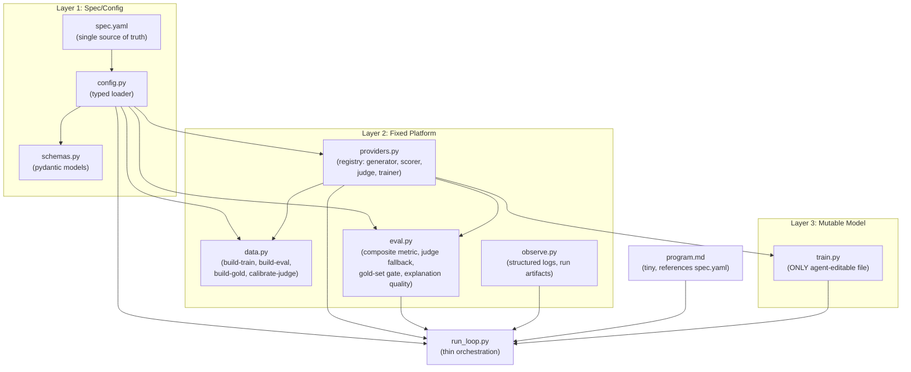

# AutoEmailTrust v3.3 Lean

Rewrite of v3.2 following the autoresearch philosophy: one mutable file (`train.py`), one fixed evaluation/data layer, one thin orchestration layer. All configuration lives in `spec.yaml`. No duplicated rules.

## 3-Layer Architecture



## File Layout

```
autoresearch-helpful/
├── pyproject.toml
├── .env.example
├── .gitignore
├── spec.yaml                # single source of truth
├── autotrust/
│   ├── __init__.py
│   ├── config.py            # typed settings loader
│   ├── schemas.py           # pydantic models
│   ├── providers.py         # local / hyperbolic / anthropic adapters
│   ├── data.py              # train/eval/gold generation + calibration
│   ├── eval.py              # fixed metrics, judge fallback, gold-set gate
│   └── observe.py           # logging, run artifacts
├── train.py                 # ONLY agent-editable file
├── run_loop.py              # thin orchestration
├── program.md               # tiny instruction set
├── annotation_rubric.md     # human scoring guidelines
├── README.md
├── gold_set/
│   └── gold_chains.jsonl
├── eval_set/
│   └── eval_chains.jsonl
├── synth_data/
│   └── .gitkeep
├── runs/                    # per-experiment artifacts
│   └── .gitkeep
└── tests/
    ├── test_composite_metric.py
    ├── test_escalation_rules.py
    ├── test_safety_filter.py
    ├── test_schema_validation.py
    ├── test_gold_gate.py
    ├── test_providers.py     # contract tests
    └── test_smoke.py         # 10-chain eval + 1 loop cycle
```

## `spec.yaml` -- Single Source of Truth

Every metric, threshold, provider binding, and trust-axis definition lives here. All other files read from it.

```yaml
trust_axes:
  - truthfulness
  - verify_by_search
  - manipulation
  - deceit
  - vulnerability_risk
  - subtle_toxicity
  - polarization
  - classic_email_metrics
  - authority_impersonation

composite_weights:
  phish_f1: 0.22
  truth_agreement: 0.18
  manipulation: 0.13
  deceit_recall: 0.10
  vulnerability_risk: 0.10
  subtle_toxicity: 0.08
  polarization: 0.05
  classic_email_metrics: 0.04
  authority_impersonation: 0.10
  false_positive_rate: -0.15

providers:
  generator:
    backend: local_ollama
    model: dolphin3:latest
  scorer:
    backend: hyperbolic
    model: meta-llama/Llama-3.1-8B-Instruct
  judge_primary:
    backend: anthropic
    model: claude-opus-4-20250514
  judge_secondary:
    backend: anthropic
    model: claude-sonnet-4-20250514
  trainer:
    backend: hyperbolic_gpu
    gpu_type: H100

limits:
  experiment_minutes: 15
  max_spend_usd: 8

judge:
  escalate_threshold: 0.60
  disagreement_max: 0.20
  min_gold_kappa: 0.70

safety:
  synth_placeholder_only: true
  block_operational_instructions: true
  real_brands_in_eval: true

data:
  eval_set_size: 1000
  gold_set_size: 200
  synth_real_ratio: 0.7
  train_val_test_split: [0.70, 0.15, 0.15]
```

## Implementation Details

### 1. Scaffold

- **`pyproject.toml`**: Python 3.12, uv-managed. Dependencies:
  - `anthropic`, `openai` (Hyperbolic uses OpenAI-compatible endpoint), `ollama`
  - `python-dotenv`, `pydantic`, `pyyaml`
  - `gitpython`, `httpx`, `rich`, `structlog`
  - `datasets`, `scikit-learn`
  - Dev: `pytest`, `ruff`
- **`.env.example`**: `ANTHROPIC_API_KEY=`, `HYPERBOLIC_API_KEY=`, `OLLAMA_MODEL=dolphin3:latest`
- **`.gitignore`**: `.env`, `synth_data/*.jsonl`, `runs/`, `__pycache__/`, `.venv/`
- **`spec.yaml`**: as above

### 2. `config.py` -- Typed Settings Loader

- `load_spec(path="spec.yaml") -> Spec` -- loads and validates spec.yaml into a typed pydantic model
- `get_spec() -> Spec` -- cached singleton
- All other modules import `get_spec()` instead of hardcoding values
- Validates provider bindings, weight sum, axis names at load time

### 3. `schemas.py` -- Pydantic Models

Core data models used everywhere:

- `Email` -- single email message (from, to, subject, body, timestamp, reply_depth)
- `EmailChain` -- full chain with metadata (chain_id, source, emails, thread_depth, labels, trust_vector, composite, judge/safety flags)
- `TrustVector` -- 9-dim vector with named axes (dynamically built from spec.yaml trust_axes list)
- `ExperimentResult` -- per-experiment record (run_id, change_description, per_axis_scores, composite, fp_rate, judge_agreement, gold_agreement, cost, wall_time)
- `RunArtifacts` -- paths to metrics.json, predictions.jsonl, config.json, summary.txt
- `GoldChain` -- extends EmailChain with annotator_scores, consensus_labels, inter_annotator_kappa, opus_agreement

### 4. `providers.py` -- Provider Registry

One module, four provider interfaces, configured from spec.yaml:

```python
class GeneratorProvider:    # local_ollama | local_mlx
    generate(prompt, ...) -> str
    generate_batch(prompts, concurrency=4) -> list[str]
    check_available() -> bool

class ScoringProvider:      # hyperbolic
    score(prompt, ...) -> str
    score_batch(prompts, ...) -> list[str]

class JudgeProvider:        # anthropic (Opus or Sonnet)
    judge(chain, axes) -> dict
    dual_judge(chain) -> tuple[dict, dict, float]  # scores1, scores2, agreement

class TrainingProvider:     # hyperbolic_gpu
    list_gpus() -> list
    rent_gpu(hours, name) -> str
    stop_gpu(instance_id) -> None
    get_status(instance_id) -> dict
    run_remote(instance_id, command) -> str
    budget_guard(max_usd) -> ContextManager
```

- Shared retry logic, auth loading, error handling, structured logging -- written once
- `get_provider(role: str) -> Provider` factory reads spec.yaml to instantiate the right backend
- Hyperbolic inference and Ollama both use OpenAI-compatible client pattern (swap `base_url` + `api_key`)
- Anthropic uses direct `anthropic.Anthropic` client
- GPU rental uses `httpx` for Hyperbolic Marketplace API

### 5. `data.py` -- Fixed Data Module

All dataset behavior in one file, invoked as subcommands:

```bash
uv run python -m autotrust.data build-train --count 5000
uv run python -m autotrust.data build-eval
uv run python -m autotrust.data build-gold
uv run python -m autotrust.data annotate-export    # exports chains for human annotation
uv run python -m autotrust.data calibrate-judge    # measures Opus-human Kappa per axis
```

Internally:

**Real corpora loader:**
- `load_spamassassin()` -- SpamAssassin corpus, real brands preserved
- `load_enron_threads()` -- Enron dataset, multi-message chains, real names preserved
- Labels via JudgeProvider (Opus)

**Synthetic generator (via GeneratorProvider = local Ollama):**
1. Seed threads from Dolphin 3.0 (benign + structural malicious, placeholders only)
2. Safety filter: reject operational phishing instructions (regex + blocklist from spec.yaml safety config)
3. Evol-Instruct (4 epochs via GeneratorProvider)
4. SpearBot-style critic loop (generate -> critic -> refine)
5. Dual-judge labeling via JudgeProvider (primary + secondary, disagreement filter)
6. Deduplicate

**Gold set workflow:**
1. `build-gold`: generates 200 diverse chains (mix of real + synthetic)
2. `annotate-export`: outputs annotation-ready format for human scorers
3. `calibrate-judge`: ingests human annotations, computes Cohen's Kappa per axis, measures Opus alignment, flags axes with Kappa < min_gold_kappa from spec.yaml

**Data schema:** same 9-dim EmailChain from schemas.py. Gold chains extend with annotator scores and Kappa values.

### 6. `eval.py` -- Fixed Evaluation Policy

All scoring contract, judge escalation, gold-set gating, and metric math in one file:

```python
def score_predictions(predictions: list, ground_truth: list, spec: Spec) -> dict:
    """Per-axis metrics: F1 for binary, agreement for continuous."""

def compute_composite(per_axis: dict, spec: Spec) -> float:
    """Weighted sum from spec.yaml composite_weights, including FP penalty."""

def run_judge_fallback(chain, fast_scores, judge: JudgeProvider, spec: Spec) -> dict:
    """Escalate to judge if any subtle axis > escalate_threshold."""

def gold_regression_gate(predictions, gold_set, previous_best, spec: Spec) -> bool:
    """Returns True if change is acceptable (no axis degrades vs human labels)."""

def explanation_quality(explanations, ground_truth_axes) -> float:
    """Does the explanation mention the correct flagged axes?"""
```

- Reads all thresholds, weights, and axis lists from spec.yaml via config
- This is the most important DRY move: the scoring contract exists in exactly one place

### 7. `observe.py` -- Structured Logging + Run Artifacts

Lean observability layer using `structlog`:

- `init_logging()` -- configure structlog with JSON output
- `start_run(spec) -> RunContext` -- creates `runs/<run_id>/` directory, snapshots config.json
- `log_experiment(ctx, result: ExperimentResult)` -- writes to metrics.json
- `log_predictions(ctx, predictions)` -- writes predictions.jsonl
- `finalize_run(ctx)` -- writes summary.txt
- `export_leaderboard(runs_dir) -> str` -- derives CSV/TSV from all runs (optional convenience)

No OpenTelemetry at this stage. Structured logs + JSON artifacts are sufficient for the autoresearch loop. OTLP can be layered in later if needed.

### 8. `train.py` -- The Only Mutable File

Baseline scorer the autoresearch agent will iterate on:

- `EmailTrustScorer` class:
  - `score_chain(chain) -> dict` -- returns 9-dim trust vector + composite + explanation
  - `score_batch(chains) -> list` -- batch scoring
  - `explain(chain) -> str` -- structured reasons
- **Initial baseline:** thread-aware prompt via ScoringProvider (Hyperbolic Llama-3.1-8B) that asks about inter-message patterns, authority impersonation, persuasion progression
- **Thread encoder signals:** reply timing, escalation, authority shifts, social engineering buildup
- **LoRA scaffolding:** `fine_tune(data_path, trainer: TrainingProvider)` and `load_fine_tuned(checkpoint)` as placeholders
- Uses providers from `providers.py` -- never constructs clients directly

### 9. `run_loop.py` -- Thin Orchestration

Minimal loop that delegates everything to the platform layer:

```python
spec = get_spec()
scorer = get_provider("scorer")
judge = get_provider("judge_primary")
run_ctx = start_run(spec)

while experiment_count < max_experiments:
    # 1. Call Sonnet with program.md + train.py + last N results
    # 2. Apply proposed edit to train.py
    # 3. predictions = score all eval chains via train.py
    # 4. metrics = eval.score_predictions(predictions, ground_truth, spec)
    # 5. composite = eval.compute_composite(metrics, spec)
    # 6. gold_ok = eval.gold_regression_gate(predictions, gold_set, prev_best, spec)
    # 7. if improved AND gold_ok: git commit, log success
    #    else: git checkout -- train.py, log regression
    # 8. observe.log_experiment(run_ctx, result)
    # 9. if 3 consecutive no-improvement: nudge toward LoRA
    # 10. enforce budget/time from spec.limits
```

Tool definitions passed to Anthropic:
- `edit_train(new_content)`, `run_evaluation()`, `rent_gpu(...)`, `stop_gpu(...)`, `run_remote(...)`, `get_experiment_history()`

### 10. `program.md` -- Tiny Instruction Set

Short and references spec.yaml for authority:

```
You are optimizing a content-only email trust scorer.

Rules:
- Only edit train.py
- Budget: see spec.yaml limits (currently 15 min / $8)
- Base model: see spec.yaml providers.scorer (currently Llama-3.1-8B on Hyperbolic)
- Changes that degrade gold-set agreement on any axis are auto-rejected

Trust axes and composite weights are defined in spec.yaml. Do not change them.

Priorities:
1. Thread encoder: per-email embeddings -> attention over thread -> chain classifier
2. Multi-task heads for solved axes (phish, manipulation, classic, authority_impersonation)
3. Explanation output: structured reasons why email is suspicious
4. When gains stall: LoRA fine-tune via TrainingProvider (auto-terminate GPUs)

Start now.
```

## Test Strategy

Platform code is heavily tested. `train.py` is lightly smoke-tested but free to evolve.

**Unit tests:**
- `test_composite_metric.py` -- composite formula matches spec.yaml weights, FP penalty works
- `test_escalation_rules.py` -- judge fallback triggers at spec threshold, not below
- `test_safety_filter.py` -- rejects operational instructions, allows structural malicious
- `test_schema_validation.py` -- EmailChain, TrustVector, ExperimentResult round-trip correctly
- `test_gold_gate.py` -- rejects experiments that degrade any axis vs human labels, accepts genuine improvements

**Contract tests (`test_providers.py`):**
- Mock/fixture-based tests for each provider interface
- GeneratorProvider: returns well-formed text, handles batch
- ScoringProvider: returns parseable scores, handles retry
- JudgeProvider: returns per-axis scores matching trust_axes list, dual_judge returns agreement
- TrainingProvider: rent/stop lifecycle, budget guard triggers at limit

**Smoke tests (`test_smoke.py`):**
- Tiny eval set of 10 chains, tiny gold set of 10 chains
- One full run_loop cycle with a dummy `train.py` that returns fixed scores
- Verifies the git commit/discard cycle works end-to-end

**Regression tests (frozen data):**
- Gold-set agreement checks against committed gold_chains.jsonl
- False-positive test slice (known-legitimate chains must score below threshold)
- Explanation format validation (structured output matches expected schema)

## Execution Order

1. **Scaffold**: pyproject.toml, .env.example, .gitignore, spec.yaml
2. **Core platform**: config.py, schemas.py, providers.py
3. **Unit + contract tests** for core platform (TDD: write tests first)
4. **Fixed data/eval**: data.py, eval.py
5. **Unit tests** for data/eval (composite metric, escalation, safety filter, gold gate)
6. **observe.py** (structured logging, run artifacts)
7. **annotation_rubric.md** (human scoring guidelines)
8. Generate gold-set candidates: `uv run python -m autotrust.data build-gold`
9. **HUMAN STEP**: annotate 200 chains, run `calibrate-judge`
10. **train.py** baseline scorer
11. **program.md** (tiny, references spec.yaml)
12. **run_loop.py** (thin orchestration)
13. **Smoke tests** (10-chain eval, 1 loop cycle)
14. Generate eval_set: `uv run python -m autotrust.data build-eval`
15. Update README.md
