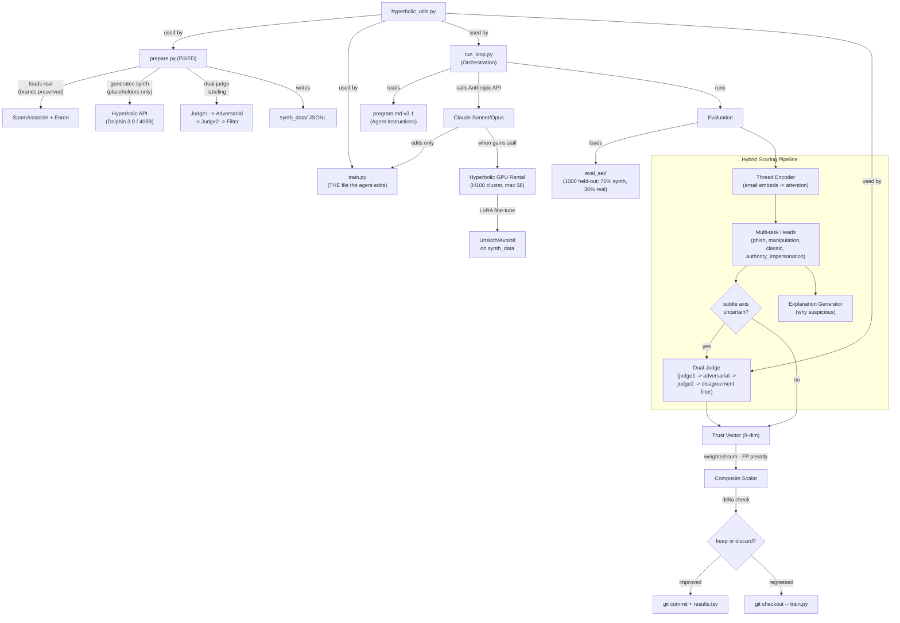

# AutoEmailTrust v3.1 Implementation Plan

Updates from v3: (1) thread structure modeling with hierarchical encoding, (2) hybrid safety policy (real brands in eval from real corpora, placeholders in synthetic generation), (3) dual-judge labeling pipeline to prevent model-teaching-model loops, (4) authority impersonation as 9th trust dimension, (5) false positive penalty in composite metric, (6) explanation generator for usability.

## Architecture Overview



## File Structure

```
autoresearch-helpful/
├── pyproject.toml           # uv project config, all deps
├── .env.example             # template for API keys
├── .env                     # (gitignored) actual keys
├── .gitignore
├── README.md                # updated with v3.1 architecture + quickstart
├── program.md               # v3.1 agent instruction set
├── run_loop.py              # orchestration: Anthropic API -> edit -> eval -> git
├── prepare.py               # FIXED: real corpora + safe synthetic generator
├── train.py                 # ONLY file the agent edits (thread-aware scorer + LoRA)
├── hyperbolic_utils.py      # inference API + GPU rental + YaRN helper
├── judge_rubric.py          # dual-judge pipeline for subtle axes
├── eval_set/                # 1,000 held-out chains (70% synth + 30% real)
│   └── eval_chains.jsonl
├── synth_data/              # generated synthetic training data
│   └── .gitkeep
└── results.tsv              # auto-logged experiment results
```

## What Changed from v3 to v3.1

### Change 1: Thread Structure Modeling
- `train.py` skeleton now includes a concrete **thread encoder architecture**: per-email embeddings -> attention over thread -> chain-level classifier
- Captures reply timing, escalation patterns, persuasion progression, authority shifts, and social engineering buildup across multi-message chains
- The agent's optimization target is now explicitly: improve the thread encoder, not just the prompt
- This is the single biggest accuracy improvement for multi-message spearphishing detection

### Change 2: Hybrid Safety Policy
- **Synthetic generation**: still placeholder-only (no real brands, no operational phishing instructions)
- **Real corpora in eval_set**: SpamAssassin and Enron data retains real brand names (Microsoft, DocuSign, FedEx, etc.) as-is
- Rationale: the model must learn to recognize real-world brand impersonation patterns from the eval set, but we never *generate* copy-pasteable phishing content
- The safety constraint becomes: "no operational phishing instructions" rather than "no real brands anywhere"

### Change 3: Dual-Judge Labeling Pipeline
- Replaces single-judge validation to prevent model-teaching-model loops
- Pipeline: generate -> judge1 scores -> adversarial generator tries to fool judge1 -> judge2 independently scores -> if judge1 and judge2 disagree, discard the sample
- Higher label quality, especially on subtle axes where single-judge reliability is low

### Change 4: Authority Impersonation (9th dimension)
- New trust vector dimension: `authority_impersonation` (0.0-1.0)
- Detects "Hi this is the CFO" style impersonation -- the most common spearphishing pattern
- Trust vector goes from 8-dim to **9-dim**
- Composite formula updated with new weight allocation

### Change 5: False Positive Penalty
- Added `false_positive_penalty` to composite metric
- Penalizes the scorer for flagging legitimate email as suspicious
- Critical for production viability -- security systems fail when they over-flag

### Change 6: Explanation Generator
- `train.py`'s `EmailTrustScorer` now also outputs structured explanations
- Example: "Trust score: 0.18 -- authority impersonation, urgent financial request, unverifiable claim, manipulation language"
- Dramatically improves usability for security teams
- Low implementation cost since the judge already produces rationale

## Implementation Details

### 1. Project Setup (`pyproject.toml`, `.env.example`, `.gitignore`)

- **`pyproject.toml`**: Python 3.12, managed by uv. Dependencies:
  - `anthropic` (direct API calls for orchestration + Opus judge)
  - `openai` (Hyperbolic inference uses OpenAI-compatible endpoint)
  - `python-dotenv` (load `.env`)
  - `GitPython` (programmatic git keep/discard)
  - `httpx` (Hyperbolic Marketplace API for GPU rental)
  - `rich` (logging + experiment output)
  - `datasets` (loading SpamAssassin / Enron corpora from HuggingFace)
  - `scikit-learn` (F1 score, classification metrics for eval)
  - Dev deps: `pytest`, `ruff`
- **`.env.example`**: `ANTHROPIC_API_KEY=`, `HYPERBOLIC_API_KEY=`
- **`.gitignore`**: `.env`, `synth_data/*.jsonl`, `__pycache__/`, `.venv/`, `results.tsv`

### 2. `hyperbolic_utils.py` -- Inference + GPU Rental + YaRN

Three sections:

**A. Inference (OpenAI-compatible)**
- `get_inference_client()` -- returns `openai.OpenAI` configured with Hyperbolic base URL and key
- `generate_completion(prompt, model="meta-llama/Llama-3.1-8B-Instruct", ...)` -- wrapper with retry logic, default to 8B for fast scoring
- `generate_batch(prompts, ...)` -- concurrent batch inference via asyncio
- `generate_judge(prompt, model="meta-llama/Llama-3.1-405B-Instruct")` -- dedicated 405B path for judge calls

**B. GPU Rental (Marketplace API via httpx)**
- `list_available_gpus(gpu_type="H100")` -- `GET /v1/marketplace`
- `rent_gpu(cluster_id, hours, name)` -- `POST /v1/marketplace/instances`
- `stop_gpu(instance_id)` -- terminate instance
- `get_gpu_status(instance_id)` -- check running/cost
- `run_remote_command(instance_id, command)` -- SSH exec wrapper
- `BudgetGuard` context manager -- tracks spend, auto-terminates at $8 limit

**C. YaRN Context Extension**
- `yarn_extend_context(base_model, target_ctx_len, finetune_steps=400)` -- generates the shell commands / training config for YaRN extension on a rented GPU
- Used when the agent decides to push past 128k (unlikely but available)

### 3. `judge_rubric.py` -- Dual-Judge Pipeline

Now implements a full dual-judge pipeline rather than single-judge validation:

- `JudgeRubric` class with methods:
  - `judge_chain(chain, axes=["subtle_toxicity", "deceit", "polarization", "vulnerability_risk", "authority_impersonation"])` -- returns per-axis scores with rationale
  - `should_escalate(fast_scores: dict, threshold=0.6)` -- determines if fast scorer output on subtle axes needs judge review
  - `dual_judge_label(chain)` -- full pipeline: judge1 scores -> adversarial generator creates hard variant -> judge2 independently scores -> disagreement filter
  - `disagreement_filter(scores1, scores2, max_divergence=0.2)` -- returns True if judges agree (sample is usable), False if they diverge (discard)
- **Bias mitigations** (baked into prompt construction):
  - Position bias: randomize presentation order of email messages
  - Verbosity bias: instruct judge to score based on substance not length
  - Self-enhancement bias: use different models for judge1 (Opus) and judge2 (Hyperbolic 405B) to avoid self-reinforcement
- Uses `hyperbolic_utils.generate_judge()` for Hyperbolic path, direct `anthropic` client for Opus path
- Returns structured JSON matching the 9-dim trust vector schema

### 4. `prepare.py` -- Data Pipeline (FIXED, never edited by agent)

Two data sources with hybrid safety policy and dual-judge labeling:

**A. Real Corpora Loader (real brands preserved)**
- `load_spamassassin()` -- downloads SpamAssassin public corpus, parses into email chain format. Real brand names (Microsoft, DocuSign, etc.) are kept as-is
- `load_enron_threads()` -- loads Enron email dataset (threaded conversations), filters to multi-message chains. Real names/companies preserved
- Labels real emails using `judge_rubric.dual_judge_label()` for ground truth on all 9 axes

**B. Synthetic Generator (placeholders only, no operational instructions)**
1. Generate 150-200 human-quality seed threads (benign + structural malicious) using Hyperbolic Dolphin 3.0 / 405B
2. **Safety filter**: reject examples containing operational phishing instructions (credential harvesting steps, fake login page URLs, social engineering scripts). Real brand names are replaced with placeholders in synthetic data only
3. Evol-Instruct (4 epochs): progressively increase complexity/subtlety of malicious examples
4. SpearBot-style critic loop: generate -> critic evaluates detectability -> refine until subtle but still structurally malicious
5. **Dual-judge labeling**: judge1 (Opus) scores -> adversarial generator -> judge2 (405B) scores -> disagreement filter discards low-confidence labels
6. Deduplicate via embedding similarity

**C. Data Splits**
- `--seed-eval`: generates 1,000 held-out chains (70% synthetic with placeholders, 30% real with real brands) for `eval_set/eval_chains.jsonl`
- `--generate-train N`: generates N training chains to `synth_data/`
- 70/15/15 train/val/test split within training data

**Updated schema per email chain (9-dim):**
```python
{
    "chain_id": "uuid",
    "source": "synthetic" | "spamassassin" | "enron",
    "emails": [
        {
            "from": "...",
            "to": "...",
            "subject": "...",
            "body": "...",
            "timestamp": "...",
            "reply_depth": int
        }
    ],
    "thread_depth": int,
    "labels": {
        "phish": 0 | 1,
        "truthfulness": 0.0-1.0,
        "verify_by_search_flag": true | false,
        "manipulation": 0.0-1.0,
        "deceit": 0.0-1.0,
        "vulnerability_risk": 0.0-1.0,
        "subtle_toxicity": 0.0-1.0,
        "polarization": 0.0-1.0,
        "classic_email_metrics": 0.0-1.0,
        "authority_impersonation": 0.0-1.0
    },
    "trust_vector": [float, ...],
    "composite_trust_score": float,
    "dual_judge_validated": bool,
    "judge_agreement": float,
    "safety_checked": true
}
```

### 5. `train.py` -- Starter Skeleton (the ONLY file the agent edits)

Now includes thread-aware architecture and explanation output:

- `EmailTrustScorer` class:
  - `score_chain(chain: dict) -> dict` -- returns 9-dim trust vector + composite scalar + explanation
  - `score_batch(chains: list) -> list` -- batch scoring
  - `explain(chain: dict) -> str` -- returns structured explanation of why email is suspicious
- **Thread encoder architecture** (baseline the agent improves):
  - Per-email embedding via Llama-3.1-8B (each email in the chain encoded separately)
  - Attention over thread sequence (captures reply timing, escalation, persuasion progression)
  - Chain-level classifier with per-axis heads
  - Initial implementation: simplified version using LLM inference with thread-aware prompt that explicitly asks about inter-message patterns
  - The agent evolves this toward actual model heads via LoRA
- **Key signals the thread encoder should capture:**
  - Reply timing and urgency escalation
  - Authority shifts (casual -> authoritative)
  - Persuasion progression (rapport -> small ask -> big ask)
  - Social engineering buildup patterns
- **Explanation generator:**
  - Outputs structured reasons: e.g. "authority impersonation, urgent financial request, unverifiable claim, manipulation language"
  - Extracted from the chain-of-thought reasoning during scoring
- **LoRA fine-tune scaffolding** (agent fills in):
  - `fine_tune(data_path, gpu_instance_id)` -- placeholder for Unsloth/Axolotl training code
  - `load_fine_tuned(checkpoint_path)` -- loads LoRA adapter weights
- Uses `hyperbolic_utils` for all inference and GPU operations

The composite metric formula is hardcoded in `run_loop.py`'s evaluator, not in `train.py`. The agent changes *how* scores are produced but not how they're combined.

### 6. `program.md` -- Agent Instructions (v3.1)

Updated instruction set:

```
You are optimizing the world's best content-only email trust scorer using the autoresearch loop.

Rules (immutable):
- Only edit train.py
- Every experiment <= 15 min wall time OR <= $8 Hyperbolic spend
- Use Llama-3.1-8B (or YaRN-extended) base; never the original 50M GPT
- Synthetic data uses placeholders; eval_set contains real brands from real corpora

Metric (do NOT change):
trust_vector = [truthfulness, verify_by_search_flag, manipulation, deceit,
                vulnerability_given_ask, subtle_toxicity, polarization,
                classic_metrics, authority_impersonation]
composite = (0.22*phish_f1 + 0.18*truth_agreement + 0.13*manipulation
           + 0.10*deceit_recall + 0.10*vuln_risk + 0.08*toxicity
           + 0.05*polarization + 0.04*classic + 0.10*authority_impersonation)
           - 0.15*false_positive_rate

Priorities:
1. Thread encoder: email embeddings -> attention over thread -> chain classifier
2. Multi-task heads for phishing/manipulation/classic/authority_impersonation
3. Explanation output: structured reasons why email is suspicious
4. When gains stall -> YaRN context extension OR larger base model swap
5. Always run dual-judge on subtle axes (toxicity, deceit, polarization, vulnerability)
6. Log vector agreement with judge + false positive rate

If you rent GPUs, terminate before ending experiment.
Start now.
```

### 7. `run_loop.py` -- Autoresearch Orchestration

The core loop, driven by plain Anthropic API calls (no SDK):

```
while experiment_count < max_experiments:
    1. Call Claude (Sonnet) with:
       - program.md v3.1 as system prompt
       - Current train.py content
       - Last N experiment results from results.tsv
       - Available tools: edit_file, run_eval, rent_gpu, stop_gpu, run_remote
    2. Claude proposes a change to train.py
    3. Apply the edit to train.py
    4. Run evaluation against eval_set/:
       a. Fast scorer (train.py) produces 9-dim trust vector for each chain
       b. For chains where subtle axes > threshold: invoke dual-judge pipeline
       c. Compute composite scalar from final trust vector minus FP penalty
    5. Compare composite to previous best
    6. If improved: git commit with experiment metadata, append to results.tsv
       If regressed: git checkout -- train.py
    7. Log to results.tsv: experiment_id, change_description, per_axis_scores (9 cols),
       composite, false_positive_rate, judge_agreement, explanation_quality, cost, wall_time
    8. If 3 consecutive no-improvement: prompt Claude to consider LoRA fine-tune
    9. Enforce: <=15 min wall time, <=$8 Hyperbolic spend per experiment
```

**Tool definitions** (passed to Anthropic tool-use API):
- `edit_train(new_content: str)` -- replace train.py contents
- `run_evaluation()` -- execute eval, return 9-dim trust vector + composite + FP rate + judge agreement + explanation samples
- `rent_gpu(gpu_type, hours, name)` -- provision Hyperbolic GPU
- `stop_gpu(instance_id)` -- terminate GPU
- `run_remote(instance_id, command)` -- execute on rented GPU
- `get_experiment_history()` -- last N results from results.tsv

### 8. Evaluation Engine (inside `run_loop.py`)

- Load `eval_set/eval_chains.jsonl`
- Run each chain through current `train.py`'s `EmailTrustScorer.score_chain()`
- For subtle axes, invoke `judge_rubric.py` dual-judge when fast scores > escalation threshold
- Compare predicted trust vectors vs ground truth labels
- Per-axis metrics: F1 for binary axes (phish), agreement score for continuous axes, precision/recall for authority_impersonation
- Composite: `(0.22*phish_f1 + 0.18*truth_agreement + 0.13*manipulation + 0.10*deceit_recall + 0.10*vuln_risk + 0.08*toxicity + 0.05*polarization + 0.04*classic + 0.10*authority_impersonation) - 0.15*false_positive_rate`
- Also compute: judge vector agreement, false positive rate on known-legitimate chains, explanation quality (does explanation mention the correct flagged axes?)
- Return full 9-dim trust vector breakdown + composite scalar + FP rate + judge agreement + explanation samples

## Key Design Decisions

- **No Claude Agent SDK** -- plain `anthropic` library with tool-use for full control over the loop, budget enforcement, and git integration
- **uv for package management** -- `pyproject.toml` with `uv sync` / `uv run`
- **Llama-3.1-8B as base** (128k native context) -- eliminates the 2048 truncation problem entirely; YaRN available as escape hatch
- **Thread-aware architecture** -- email embeddings -> attention over thread -> per-axis heads. Not flat text classification
- **9-dim trust vector** -- added authority_impersonation (most common spearphishing pattern)
- **False positive penalty** -- composite metric penalizes over-flagging legitimate email (production-critical)
- **Hybrid safety policy** -- real brands in eval_set from real corpora, placeholder-only in synthetic generation, no operational phishing instructions anywhere
- **Dual-judge labeling** -- judge1 (Opus) + adversarial generator + judge2 (405B) + disagreement filter. Prevents model-teaching-model loops
- **Explanation generator** -- structured "why suspicious" output for security team usability
- **Git as experiment tracker + results.tsv** -- commits for improvements, TSV for full history including regressions
- **Budget enforcement** -- `BudgetGuard` context manager wraps GPU ops; `run_loop.py` tracks per-experiment wall time and spend
- **Hot-reload train.py** -- use `importlib.reload()` or subprocess to pick up agent edits without restarting
- **Eval set is sacred** -- generated once via `prepare.py --seed-eval` (70/30 synth/real mix), committed to git, never modified by the agent

## Execution Order

Build files in dependency order so each file is testable as it's written:

1. Project scaffolding (pyproject.toml, .env.example, .gitignore)
2. `hyperbolic_utils.py` (no internal deps)
3. `judge_rubric.py` (depends on hyperbolic_utils + anthropic)
4. `prepare.py` (depends on hyperbolic_utils, judge_rubric)
5. `train.py` skeleton (depends on hyperbolic_utils)
6. `program.md` v3.1 (static text)
7. `run_loop.py` with evaluation engine (depends on all above)
8. Generate seed `eval_set/` data (run prepare.py --seed-eval)
9. Update README.md with v3.1 architecture + quickstart + hybrid safety policy
