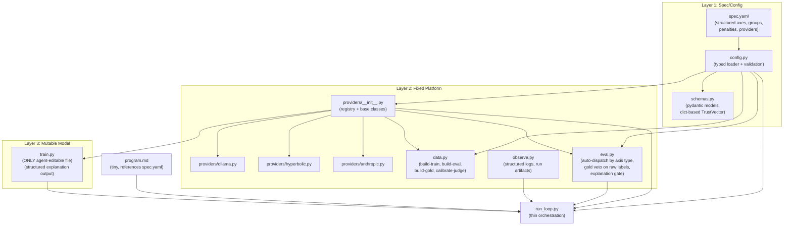

# Masubi

Updates from v3.4: (1) Fixed axis/weight naming mismatch -- trust_axes are now structured objects with name/type/metric/weight, composite_penalties is a separate section, (2) axis_groups encode binary/continuous/subtle/fast groupings in spec, (3) TrustVector is `dict[str, float]` validated against spec (not dynamic pydantic), (4) explanation gate supports `warn_then_gate` mode, (5) Kappa downweighting explicitly scoped to composite only -- gold-set veto always uses raw human labels, (6) explanation quality concretely defined as flagged-axis coverage, (7) train.py emits structured explanation (reasons array) not CoT extraction.

## 3-Layer Architecture



## File Layout

```
autoresearch-helpful/
├── pyproject.toml
├── .env.example
├── .gitignore
├── spec.yaml                    # single source of truth (structured axes)
├── autotrust/
│   ├── __init__.py
│   ├── config.py                # typed settings loader + validation
│   ├── schemas.py               # pydantic models (dict-based TrustVector)
│   ├── providers/
│   │   ├── __init__.py          # registry, base classes, get_provider()
│   │   ├── ollama.py            # GeneratorProvider (local Dolphin 3.0)
│   │   ├── hyperbolic.py        # ScoringProvider + TrainingProvider
│   │   └── anthropic.py         # JudgeProvider (Opus primary, configurable secondary)
│   ├── data.py                  # train/eval/gold generation + calibration
│   ├── eval.py                  # fixed metrics, judge fallback, gold-set veto, explanation gate
│   └── observe.py               # logging, run artifacts
├── train.py                     # ONLY agent-editable file
├── run_loop.py                  # thin orchestration
├── program.md                   # tiny instruction set
├── annotation_rubric.md         # human scoring guidelines (written BEFORE data gen)
├── README.md
├── gold_set/
│   └── gold_chains.jsonl
├── eval_set/
│   └── eval_chains.jsonl
├── synth_data/
│   └── .gitkeep
├── runs/                        # per-experiment artifacts
│   └── .gitkeep
└── tests/
    ├── test_composite_metric.py
    ├── test_kappa_downweight.py
    ├── test_escalation_rules.py
    ├── test_safety_filter.py
    ├── test_schema_validation.py
    ├── test_gold_gate.py
    ├── test_explanation_gate.py
    ├── test_providers.py         # contract tests (per-backend)
    └── test_smoke.py             # 10-chain eval + 1 loop cycle
```

## `spec.yaml` -- Single Source of Truth

### Structured Axis Definitions

Each axis declares its own name, type, evaluation metric, and composite weight. `eval.py` dispatches automatically: binary axes get F1, continuous axes get agreement. No name-translation layer needed.

```yaml
trust_axes:
  - name: phish
    type: binary
    metric: f1
    weight: 0.22
  - name: truthfulness
    type: continuous
    metric: agreement
    weight: 0.18
  - name: verify_by_search
    type: binary
    metric: f1
    weight: 0.00       # tracked and gated, but zero-weighted until ready
  - name: manipulation
    type: continuous
    metric: agreement
    weight: 0.13
  - name: deceit
    type: continuous
    metric: recall
    weight: 0.10
  - name: vulnerability_risk
    type: continuous
    metric: agreement
    weight: 0.10
  - name: subtle_toxicity
    type: continuous
    metric: agreement
    weight: 0.08
  - name: polarization
    type: continuous
    metric: agreement
    weight: 0.05
  - name: classic_email_metrics
    type: continuous
    metric: agreement
    weight: 0.04
  - name: authority_impersonation
    type: continuous
    metric: agreement
    weight: 0.10

composite_penalties:
  false_positive_rate: -0.15

axis_groups:
  binary:
    - phish
    - verify_by_search
  continuous:
    - truthfulness
    - manipulation
    - deceit
    - vulnerability_risk
    - subtle_toxicity
    - polarization
    - classic_email_metrics
    - authority_impersonation
  subtle:
    - deceit
    - subtle_toxicity
    - polarization
    - vulnerability_risk
    - authority_impersonation
  fast:
    - phish
    - verify_by_search
    - manipulation
    - classic_email_metrics

providers:
  generator:
    backend: local_ollama
    model: dolphin3:latest
  scorer:
    backend: hyperbolic
    model: meta-llama/Llama-3.1-8B-Instruct
  judge_primary:
    backend: anthropic
    model: claude-opus-4-20250514
  judge_secondary:
    backend: anthropic
    model: claude-sonnet-4-20250514
  trainer:
    backend: hyperbolic_gpu
    gpu_type: H100

limits:
  experiment_minutes: 15
  max_spend_usd: 8

judge:
  escalate_threshold: 0.60
  disagreement_max: 0.20
  min_gold_kappa: 0.70

calibration:
  downweight_policy: kappa_proportional
  redistribute_remainder: true
  log_downweighted_axes: true
  scope: composite_only             # downweighting NEVER affects gold-set veto

explanation:
  mode: warn_then_gate              # warn (log only) -> gate (blocks keep/discard)
  flag_threshold: 0.5               # axis scores above this are "flagged"
  min_quality_threshold: 0.5        # explanation quality must be >= this to pass gate
  gate_after_baseline: true         # gate activates after first successful experiment

safety:
  synth_placeholder_only: true
  block_operational_instructions: true
  real_brands_in_eval: true

data:
  eval_set_size: 1000
  gold_set_size: 200
  synth_real_ratio: 0.7
  train_val_test_split: [0.70, 0.15, 0.15]
```

### What the Structured Spec Fixes

**Before (v3.4):** `composite_weights` had keys like `phish_f1`, `truth_agreement`, `deceit_recall` that didn't match `trust_axes` names. Every consumer needed its own mapping.

**After (v3.5):** Each axis carries its own weight and metric type. `config.py` validates that every axis has a weight, `eval.py` auto-dispatches metric computation by type, and `verify_by_search` is explicitly tracked at weight 0.00 (participates in gold-set veto but doesn't affect composite until promoted).

`composite_penalties` is a separate section for cross-cutting penalties (like `false_positive_rate`) that aren't axis scores.

`axis_groups` encode which axes are binary/continuous/subtle/fast, removing hidden policy from `eval.py`.

## Key Policy Decisions (v3.5)

### Keep/Discard Decision: Three Gates

```
1. Composite improved?     (Kappa-adjusted axis weights + penalties, auto-dispatched metrics)
2. Gold-set veto passed?   (raw human labels, NO downweighting, all axes including zero-weighted)
3. Explanation gate?       (warn_then_gate: logs only until baseline, then blocks)
```

### Kappa Downweighting: Composite Only

- Kappa-proportional downweighting applies to `compute_composite()` only
- `gold_regression_gate()` always compares against raw human consensus labels
- The veto never uses downweighted logic -- it checks every axis directly, including zero-weighted ones like `verify_by_search`
- This means an axis can be downweighted in composite (contributing less to ranking) while still having full veto power via the gold set

### Explanation Quality: Concrete Definition

For each axis scoring above `flag_threshold` (0.5), the explanation must contain a semantic reference to that axis:

```
explanation_quality = (axes correctly referenced in explanation) / (axes flagged above threshold)
```

- An email with no axes flagged above threshold automatically passes (quality = 1.0)
- An email with 3 flagged axes where the explanation only mentions 1 gets quality = 0.33
- The `reasons` array in the structured output is what gets checked -- each reason must map to a flagged axis

### Explanation Gate: `warn_then_gate` Mode

- **Before baseline**: explanation quality is computed and logged but does not block keep/discard
- **After first successful experiment**: explanation gate becomes hard -- quality must be >= `min_quality_threshold`
- Rationale: early experiments may produce poor explanations while improving scoring; blocking them too early starves the loop. Once baseline quality is established, the agent must maintain it.

### Composite + FP Penalty + Gold Veto Interaction

The `false_positive_rate: -0.15` penalty in `composite_penalties` penalizes FP in the composite score. The gold-set veto separately rejects any axis regression. An experiment can improve composite (other axes offset the FP penalty) but still be rejected by the gold gate because FP degraded. This is intentional double-checking, documented in program.md.

## Implementation Details

### 1. Scaffold

- **`pyproject.toml`**: Python 3.12, uv-managed. Dependencies:
  - `anthropic`, `openai`, `ollama`
  - `python-dotenv`, `pydantic`, `pyyaml`
  - `gitpython`, `httpx`, `rich`, `structlog`
  - `datasets`, `scikit-learn`
  - Dev: `pytest`, `ruff`
- **`.env.example`**: `ANTHROPIC_API_KEY=`, `HYPERBOLIC_API_KEY=`, `OLLAMA_MODEL=dolphin3:latest`
- **`.gitignore`**: `.env`, `synth_data/*.jsonl`, `runs/`, `__pycache__/`, `.venv/`

### 2. `annotation_rubric.md` -- Human Scoring Guidelines

Written BEFORE any data generation. Defines the semantics of every axis:

- Per-axis definitions with concrete examples at 0.0, 0.5, and 1.0
- Binary axis criteria (phish: what makes it 0 vs 1; verify_by_search: when to flag)
- Continuous axis boundary conditions (e.g., legitimate urgency vs manipulative urgency; friendly authority vs impersonation)
- Edge case guidance (multi-intent emails, sarcasm, cultural context)
- Instructions for annotators: score independently, document uncertainty, flag ambiguous chains

### 3. `config.py` -- Typed Settings Loader

- `load_spec(path="spec.yaml") -> Spec` -- loads and validates into pydantic model
- `get_spec() -> Spec` -- cached singleton
- **Validation at load time:**
  - Every axis in `trust_axes` has a valid type (`binary` | `continuous`), metric, and weight >= 0
  - Positive axis weights sum to ~1.0 (before penalties)
  - All axis names in `axis_groups` exist in `trust_axes`
  - `composite_penalties` keys are not axis names (they're cross-cutting)
  - Provider bindings reference known backends
- `get_effective_weights(spec, calibration) -> dict` -- applies Kappa-proportional downweighting to axis weights, redistributes remainder, returns adjusted weight dict. Only used by `compute_composite()`, never by `gold_regression_gate()`.

### 4. `schemas.py` -- Pydantic Models

- `Email` -- single message (from, to, subject, body, timestamp, reply_depth)
- `EmailChain` -- chain with metadata, labels as `dict[str, float]`, trust_vector as `dict[str, float]`, composite, flags
- **TrustVector is `scores: dict[str, float]`** -- validated against spec.yaml axis names at construction time, not dynamically generated as a pydantic model
- `Explanation` -- structured explanation output:
  ```python
  class Explanation(BaseModel):
      reasons: list[str]    # axis names or semantic references
      summary: str          # human-readable summary
  ```
- `ScorerOutput` -- full output from train.py:
  ```python
  class ScorerOutput(BaseModel):
      trust_vector: dict[str, float]
      explanation: Explanation
  ```
- `ExperimentResult` -- run_id, change_description, per_axis_scores, composite, fp_rate, judge_agreement, gold_agreement, explanation_quality, downweighted_axes, gate_results, cost, wall_time
- `RunArtifacts` -- paths to metrics.json, predictions.jsonl, config.json, summary.txt
- `GoldChain` -- extends EmailChain with annotator_scores, consensus_labels, kappa, opus_agreement
- `CalibrationReport` -- per-axis Kappa, effective weights, flagged axes, downweight amounts

### 5. `providers/` -- Registry + Per-Backend Modules

**`providers/__init__.py`** -- registry and base classes:

```python
class GeneratorProvider(ABC):
    generate(prompt, ...) -> str
    generate_batch(prompts, concurrency=4) -> list[str]
    check_available() -> bool

class ScoringProvider(ABC):
    score(prompt, ...) -> str
    score_batch(prompts, ...) -> list[str]

class JudgeProvider(ABC):
    judge(chain, axes) -> dict
    dual_judge(chain) -> tuple[dict, dict, float]

class TrainingProvider(ABC):
    list_gpus() -> list
    rent_gpu(hours, name) -> str
    stop_gpu(instance_id) -> None
    get_status(instance_id) -> dict
    run_remote(instance_id, command) -> str
    budget_guard(max_usd) -> ContextManager
    yarn_extend_context(base_model, target_ctx, steps) -> str

def get_provider(role: str, spec: Spec) -> Provider
```

Shared base class handles: retry logic, structured logging, error normalization.

**`providers/ollama.py`** -- `OllamaGenerator(GeneratorProvider)`:
- Uses `ollama` Python package
- `check_available()` verifies daemon running + model pulled
- MLX fallback option for Apple Silicon

**`providers/hyperbolic.py`** -- `HyperbolicScorer(ScoringProvider)` + `HyperbolicTrainer(TrainingProvider)`:
- Scorer uses `openai.OpenAI(base_url="https://api.hyperbolic.xyz/v1", api_key=...)`
- Trainer uses `httpx` for Marketplace API (rent/stop/status/ssh)
- `BudgetGuard` context manager tracks spend, auto-terminates at limit
- `yarn_extend_context()` generates training config for YaRN on rented GPU

**`providers/anthropic.py`** -- `AnthropicJudge(JudgeProvider)`:
- Uses `anthropic.Anthropic` client directly
- `judge()` calls primary model with bias-mitigated prompt (position randomization, verbosity normalization)
- `dual_judge()` calls primary then secondary, runs disagreement filter
- Primary and secondary models configurable via spec.yaml

### 6. `data.py` -- Fixed Data Module

All dataset behavior, invoked as subcommands:

```bash
uv run python -m autotrust.data build-train --count 5000
uv run python -m autotrust.data build-eval
uv run python -m autotrust.data build-gold
uv run python -m autotrust.data annotate-export
uv run python -m autotrust.data calibrate-judge
```

Internally:
- Real corpora: SpamAssassin + Enron (real brands preserved)
- Synthetic: Dolphin 3.0 via GeneratorProvider (placeholders only, no operational instructions)
- Pipeline: seed -> safety filter -> Evol-Instruct -> SpearBot critic -> dual-judge labeling -> dedup
- `calibrate-judge`: ingests human annotations, computes Cohen's Kappa per axis, writes `gold_set/calibration.json`, logs which axes fall below min_gold_kappa
- Uses `axis_groups` from spec to determine which axes need judge escalation (subtle group)

### 7. `eval.py` -- Fixed Evaluation Policy

Auto-dispatches metric computation based on axis type from spec.yaml:

```python
def score_predictions(predictions: list, ground_truth: list, spec: Spec) -> dict:
    """Per-axis metrics. Binary axes -> F1. Continuous axes -> agreement/recall (per axis config)."""
    for axis in spec.trust_axes:
        if axis.type == "binary":
            results[axis.name] = compute_f1(preds, truth, axis.name)
        elif axis.metric == "recall":
            results[axis.name] = compute_recall(preds, truth, axis.name)
        else:
            results[axis.name] = compute_agreement(preds, truth, axis.name)

def compute_composite(per_axis: dict, spec: Spec, calibration: CalibrationReport) -> float:
    """Kappa-adjusted axis weights + composite_penalties. Uses get_effective_weights()."""

def gold_regression_gate(predictions, gold_set, previous_best, spec: Spec) -> tuple[bool, dict]:
    """Compares against RAW human consensus labels. No Kappa downweighting.
    Checks ALL axes including zero-weighted ones (e.g., verify_by_search).
    Returns (passed, per_axis_delta). Veto if ANY axis degrades."""

def explanation_quality(explanations: list[Explanation], predictions: list, spec: Spec) -> float:
    """For each chain: count axes with score > flag_threshold.
    Check if explanation.reasons references each flagged axis.
    quality = correctly_referenced / flagged_count.
    Chains with no flagged axes score 1.0. Returns mean across chains."""

def explanation_gate(quality: float, spec: Spec, has_baseline: bool) -> tuple[bool, str]:
    """Returns (passed, mode).
    mode='warn': logs quality but always passes (before baseline).
    mode='gate': blocks if quality < min_quality_threshold (after baseline)."""

def keep_or_discard(composite_improved: bool, gold_ok: bool, explanation_ok: bool) -> bool:
    """All three must pass."""

def run_judge_fallback(chain, fast_scores, judge: JudgeProvider, spec: Spec) -> dict:
    """Escalate to judge if any axis in axis_groups.subtle scores > escalate_threshold."""
```

### 8. `observe.py` -- Structured Logging + Run Artifacts

- `structlog` with JSON output
- `start_run(spec) -> RunContext` -- creates `runs/<run_id>/`, snapshots config + effective weights
- `log_experiment(ctx, result)` -- writes metrics.json, includes downweighted_axes, gate results (composite/gold/explanation), mode (warn/gate)
- `log_predictions(ctx, predictions)` -- predictions.jsonl with per-chain trust vectors and explanations
- `finalize_run(ctx)` -- summary.txt
- Calibration warnings: logs when axes are downweighted, how much weight was redistributed

### 9. `train.py` -- The Only Mutable File

Baseline scorer with structured explanation output:

- `EmailTrustScorer` class:
  - `score_chain(chain) -> ScorerOutput` -- returns trust vector (dict) + Explanation (reasons + summary)
  - `score_batch(chains) -> list[ScorerOutput]` -- batch scoring
- **Structured explanation contract:**
  ```python
  {
      "trust_vector": {"phish": 0.95, "manipulation": 0.7, ...},
      "explanation": {
          "reasons": ["authority_impersonation", "urgent_financial_request", "unverifiable_claim"],
          "summary": "Email impersonates CFO with urgent wire transfer request containing unverifiable details"
      }
  }
  ```
- The scorer explicitly emits `reasons` as a list -- NOT extracted from hidden chain-of-thought. This is testable and gateable.
- **Baseline implementation:** thread-aware prompt via ScoringProvider that asks for structured JSON output with both trust_vector and explanation fields
- **Thread encoder signals:** reply timing, escalation, authority shifts, persuasion progression
- **LoRA scaffolding:** `fine_tune(data_path, trainer: TrainingProvider)` and `load_fine_tuned(checkpoint)` as placeholders
- Uses providers -- never constructs clients directly

### 10. `run_loop.py` -- Thin Orchestration

```python
spec = get_spec()
calibration = load_calibration()
run_ctx = start_run(spec)
has_baseline = False

while experiment_count < max_experiments:
    # 1. Call Sonnet with program.md + train.py + last N results
    # 2. Apply proposed edit to train.py
    # 3. outputs: list[ScorerOutput] = score all eval chains via train.py
    # 4. metrics = eval.score_predictions(outputs, ground_truth, spec)
    # 5. composite = eval.compute_composite(metrics, spec, calibration)
    # 6. gold_ok, gold_deltas = eval.gold_regression_gate(outputs, gold_set, prev_best, spec)
    # 7. expl_quality = eval.explanation_quality(outputs, spec)
    # 8. expl_ok, expl_mode = eval.explanation_gate(expl_quality, spec, has_baseline)
    # 9. keep = eval.keep_or_discard(composite > prev_best, gold_ok, expl_ok)
    # 10. if keep: git commit, has_baseline = True
    #     else: git checkout -- train.py
    # 11. observe.log_experiment(run_ctx, result)
    # 12. if 3 consecutive no-improvement: nudge toward LoRA
    # 13. enforce budget/time from spec.limits
```

### 11. `program.md` -- Tiny Instruction Set

```
You are optimizing a content-only email trust scorer.

Rules:
- Only edit train.py
- Budget: see spec.yaml limits (currently 15 min / $8)
- Base model: see spec.yaml providers.scorer (currently Llama-3.1-8B on Hyperbolic)

Keep/discard has THREE gates (all must pass):
1. Composite score must improve (Kappa-adjusted weights + FP penalty)
2. Gold-set veto: no axis may degrade vs human consensus labels (all axes, including zero-weighted)
3. Explanation gate: after first baseline, explanation quality must be >= 0.5

The gold-set veto has absolute authority and uses raw human labels (not
Kappa-adjusted). An experiment that improves composite by +10% will still be
rejected if it degrades any single axis. Do not chase composite improvements
that ignore per-axis quality.

Your scorer must output structured JSON with both trust_vector and explanation:
  {"trust_vector": {...}, "explanation": {"reasons": [...], "summary": "..."}}
The reasons array must reference flagged axes (scores > 0.5). This is tested.

Trust axes, weights, and thresholds are in spec.yaml.

Priorities:
1. Thread encoder: per-email embeddings -> attention over thread -> chain classifier
2. Multi-task heads for fast axes (phish, manipulation, classic, verify_by_search)
3. Explanation reasons: must cover all flagged axes (this is gated after baseline!)
4. When gains stall: LoRA fine-tune via TrainingProvider (auto-terminate GPUs)

Start now.
```

## Test Strategy

Platform code is heavily tested (TDD). `train.py` is lightly smoke-tested.

**Unit tests:**
- `test_composite_metric.py` -- auto-dispatches binary->F1, continuous->agreement; formula matches spec weights; composite_penalties applied separately
- `test_kappa_downweight.py` -- proportional downweighting math, redistribution, scope is composite-only (gold veto unaffected), zero-weighted axes handled correctly
- `test_escalation_rules.py` -- judge fallback triggers for `axis_groups.subtle` at threshold
- `test_safety_filter.py` -- rejects operational instructions, allows structural malicious
- `test_schema_validation.py` -- TrustVector validates keys against spec, ScorerOutput round-trips, Explanation reasons are list[str]
- `test_gold_gate.py` -- rejects axis regressions on raw labels, no downweighting applied, zero-weighted axes still vetoed, veto overrides composite
- `test_explanation_gate.py` -- quality = flagged_referenced / flagged_total; no-flags = 1.0; warn mode logs but passes; gate mode blocks below threshold; gate_after_baseline respected

**Contract tests (`test_providers.py`):**
- Mock/fixture-based per provider interface
- OllamaGenerator: returns well-formed text, handles batch, check_available works
- HyperbolicScorer: returns parseable scores, handles retry
- HyperbolicTrainer: rent/stop lifecycle, budget guard triggers at limit
- AnthropicJudge: returns per-axis scores matching trust_axes names, dual_judge returns agreement

**Smoke tests (`test_smoke.py`):**
- Tiny eval set (10 chains), tiny gold set (10 chains)
- One full loop cycle with dummy `train.py` returning fixed ScorerOutput
- Verifies three-gate keep/discard works end-to-end
- Verifies explanation gate modes (warn vs gate) behave correctly
- Verifies structured explanation output is validated

**Regression tests (frozen data):**
- Gold-set agreement checks against committed gold_chains.jsonl (raw labels)
- False-positive test slice
- Explanation format validation (reasons array present, maps to valid axis names)

## Execution Order

1. **Scaffold**: pyproject.toml, .env.example, .gitignore, spec.yaml
2. **annotation_rubric.md** (BEFORE any data gen -- defines axis semantics for annotation)
3. **Core platform**: config.py, schemas.py, providers/ (registry + ollama.py, hyperbolic.py, anthropic.py)
4. **Unit + contract tests** for core platform (TDD)
5. **data.py + eval.py** (data module + evaluation policy with auto-dispatch and three gates)
6. **Unit tests** for data/eval (composite dispatch, downweighting, gold gate on raw labels, explanation gate modes)
7. **observe.py** (structured logging, run artifacts)
8. Generate gold-set candidates: `uv run python -m autotrust.data build-gold`
9. **HUMAN STEP**: annotate 200 chains, run `calibrate-judge`, review Kappa per axis
10. **train.py** baseline scorer (structured ScorerOutput with explanation.reasons)
11. **program.md** (tiny, explains three-gate policy + structured output contract)
12. **run_loop.py** (thin orchestration)
13. **Smoke tests** (10-chain eval, 1 loop cycle, three-gate + explanation mode verification)
14. Generate eval_set: `uv run python -m autotrust.data build-eval`
15. Update README.md

## Task Decomposition & Execution Plan

See `docs/AUTOTRUST_V35_TASKS/` for detailed task files.

### Wave 1 (parallel -- no dependencies)
| Task | Title | Complexity | Agent Type |
|------|-------|-----------|------------|
| TASK_001 | Project Scaffold (pyproject.toml, dirs) | Low | python |
| TASK_002 | Create spec.yaml | Low | python |
| TASK_003 | Write annotation_rubric.md | Medium | python |

### Wave 2 (depends on Wave 1)
| Task | Title | Complexity | Agent Type |
|------|-------|-----------|------------|
| TASK_004 | Build config.py (typed spec loader) | Medium | python |
| TASK_005 | Build schemas.py (pydantic models) | Medium | python |
| TASK_006 | Build providers/ registry + base classes | Medium | python |

### Wave 3 (depends on Wave 2 -- TASK_006)
| Task | Title | Complexity | Agent Type |
|------|-------|-----------|------------|
| TASK_007 | Build providers/ollama.py | Low | python |
| TASK_008 | Build providers/hyperbolic.py | High | python |
| TASK_009 | Build providers/anthropic.py | Medium | python |

### Wave 4 (depends on Waves 2-3)
| Task | Title | Complexity | Agent Type |
|------|-------|-----------|------------|
| TASK_010 | Build data.py (data pipeline) | High | python |
| TASK_011 | Build eval.py (three-gate eval) | High | python |
| TASK_012 | Build observe.py (logging + artifacts) | Medium | python |

### Wave 5 (depends on Waves 2-4)
| Task | Title | Complexity | Agent Type |
|------|-------|-----------|------------|
| TASK_013 | Build train.py (baseline scorer) | Medium | python |
| TASK_014 | Write program.md (agent instructions) | Low | python |

### Wave 6 (depends on Waves 4-5)
| Task | Title | Complexity | Agent Type |
|------|-------|-----------|------------|
| TASK_015 | Build run_loop.py (orchestration) | High | python |

### Wave 7 (depends on Wave 6)
| Task | Title | Complexity | Agent Type |
|------|-------|-----------|------------|
| TASK_016 | Smoke tests (end-to-end) | Medium | python |

### Wave 8 (final -- depends on everything)
| Task | Title | Complexity | Agent Type |
|------|-------|-----------|------------|
| TASK_017 | Update README.md | Low | python |
| TASK_018 | Final cleanup (tests, DRY, lint) | Medium | python |

### Summary
- **18 tasks** across **8 waves**
- **Total tests**: ~85 unit/integration tests across 12 test files
- **Critical path**: TASK_001 -> TASK_004/005/006 -> TASK_007-009 -> TASK_010/011 -> TASK_013 -> TASK_015 -> TASK_016 -> TASK_018
- **HUMAN STEP** (not a task): Between TASK_010 (build-gold) and production use, 200 chains need human annotation (2-3 annotators) followed by `calibrate-judge`
