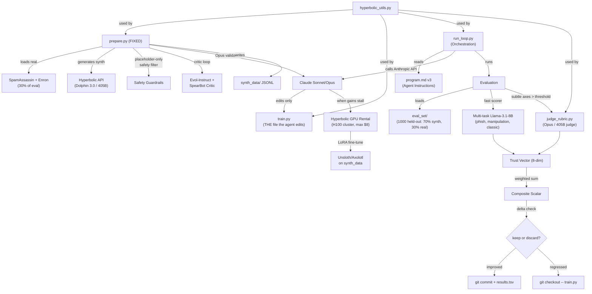

# AutoEmailTrust v3 Implementation Plan

This is an update from v2 incorporating three targeted refinements from external research reports: (1) context window fix via Llama-3.1-8B 128k native context, (2) safety/privacy guardrails with placeholder-only synthetic data, (3) hybrid architecture with fast scorer + LLM-as-judge fallback for subtle dimensions.

## Architecture Overview




## File Structure

```
autoresearch-helpful/
├── pyproject.toml           # uv project config, all deps
├── .env.example             # template for API keys
├── .env                     # (gitignored) actual keys
├── .gitignore
├── README.md                # updated with v3 architecture + quickstart
├── program.md               # v3 agent instruction set
├── run_loop.py              # orchestration: Anthropic API -> edit -> eval -> git
├── prepare.py               # FIXED: real corpora + safe synthetic generator
├── train.py                 # ONLY file the agent edits (multi-task scorer + LoRA)
├── hyperbolic_utils.py      # inference API + GPU rental + YaRN helper
├── judge_rubric.py          # NEW: structured LLM judge for subtle axes
├── eval_set/                # 1,000 held-out chains (70% synth + 30% real)
│   └── eval_chains.jsonl
├── synth_data/              # generated synthetic training data
│   └── .gitkeep
└── results.tsv              # auto-logged experiment results
```

## What Changed from v2 (and Why)

### Refinement 1: Context Window (Path B)

- v2 would have hard-coded MAX_SEQ_LEN=2048, which truncates real email threads
- v3 defaults to **Llama-3.1-8B** (128k native context) as the base model
- `hyperbolic_utils.py` gains a `yarn_extend_context()` helper for when the agent wants to push even further
- The agent's first experiment can be a base model swap without any architectural rework

### Refinement 2: Safety and Privacy Guardrails

- All synthetic generation uses **placeholder-only** tokens (no real brands, domains, phone numbers, operational phishing steps)
- `prepare.py` hard-codes a safety filter that rejects any generated example containing real-world identifiers
- Synthetic examples are "structural malicious" only -- they teach the model to recognize attack *patterns*, not produce copy-pasteable phishing templates
- Judge rubric enforces this constraint during Opus validation pass
- NIST Phish Scale ideas used conceptually; no commercial licensing of the exact scale

### Refinement 3: Hybrid Architecture

- **Solved dimensions** (phishing, manipulation, classic metrics) -> fast multi-task Llama-3.1-8B scorer with per-axis heads
- **Subtle dimensions** (toxicity, deceit, polarization, vulnerability) -> LLM-as-judge fallback (Opus or Hyperbolic 405B) via `judge_rubric.py`
- Trust score is now a **vector** (8 dimensions) + **weighted composite scalar**
- `judge_rubric.py` implements bias mitigations: position bias (randomize order), verbosity bias (length-normalize), self-enhancement bias (cross-model validation)

## Implementation Details

### 1. Project Setup (`pyproject.toml`, `.env.example`, `.gitignore`)

- `**pyproject.toml`**: Python 3.12, managed by uv. Dependencies:
  - `anthropic` (direct API calls for orchestration + Opus judge)
  - `openai` (Hyperbolic inference uses OpenAI-compatible endpoint)
  - `python-dotenv` (load `.env`)
  - `GitPython` (programmatic git keep/discard)
  - `httpx` (Hyperbolic Marketplace API for GPU rental)
  - `rich` (logging + experiment output)
  - `datasets` (loading SpamAssassin / Enron corpora from HuggingFace)
  - `scikit-learn` (F1 score, classification metrics for eval)
  - Dev deps: `pytest`, `ruff`
- `**.env.example`**: `ANTHROPIC_API_KEY=`, `HYPERBOLIC_API_KEY=`
- `**.gitignore**`: `.env`, `synth_data/*.jsonl`, `__pycache__/`, `.venv/`, `results.tsv`

### 2. `hyperbolic_utils.py` -- Inference + GPU Rental + YaRN

Three sections:

**A. Inference (OpenAI-compatible)**

- `get_inference_client()` -- returns `openai.OpenAI` configured with Hyperbolic base URL and key
- `generate_completion(prompt, model="meta-llama/Llama-3.1-8B-Instruct", ...)` -- wrapper with retry logic, default to 8B not 405B for fast scoring
- `generate_batch(prompts, ...)` -- concurrent batch inference via asyncio
- `generate_judge(prompt, model="meta-llama/Llama-3.1-405B-Instruct")` -- dedicated 405B path for judge calls

**B. GPU Rental (Marketplace API via httpx)**

- `list_available_gpus(gpu_type="H100")` -- `GET /v1/marketplace`
- `rent_gpu(cluster_id, hours, name)` -- `POST /v1/marketplace/instances`
- `stop_gpu(instance_id)` -- terminate instance
- `get_gpu_status(instance_id)` -- check running/cost
- `run_remote_command(instance_id, command)` -- SSH exec wrapper
- `BudgetGuard` context manager -- tracks spend, auto-terminates at $8 limit

**C. YaRN Context Extension**

- `yarn_extend_context(base_model, target_ctx_len, finetune_steps=400)` -- generates the shell commands / training config for YaRN extension on a rented GPU
- Used when the agent decides to push past 128k (unlikely but available)

### 3. `judge_rubric.py` -- Structured LLM Judge (NEW)

Handles the subtle axes that small models can't reliably score:

- `JudgeRubric` class with methods:
  - `judge_chain(chain, axes=["subtle_toxicity", "deceit", "polarization", "vulnerability_risk"])` -- returns per-axis scores with rationale
  - `should_escalate(fast_scores: dict, threshold=0.6)` -- determines if fast scorer output on subtle axes needs judge review
- **Bias mitigations** (baked into prompt construction):
  - Position bias: randomize presentation order of email messages
  - Verbosity bias: instruct judge to score based on substance not length
  - Self-enhancement bias: cross-validate between Opus and Hyperbolic 405B when scores diverge > 0.2
- Uses `hyperbolic_utils.generate_judge()` for Hyperbolic path, direct `anthropic` client for Opus path
- Returns structured JSON matching the trust vector schema

### 4. `prepare.py` -- Data Pipeline (FIXED, never edited by agent)

Now has two data sources and a safety-first synthetic pipeline:

**A. Real Corpora Loader**

- `load_spamassassin()` -- downloads SpamAssassin public corpus, parses into email chain format
- `load_enron_threads()` -- loads Enron email dataset (threaded conversations), filters to multi-message chains
- Labels real emails using the judge rubric (Opus) for ground truth on all 8 axes

**B. Synthetic Generator (placeholder-only)**

1. Generate 150-200 human-quality seed threads (benign + structural malicious) using Hyperbolic Dolphin 3.0 / 405B
2. **Safety filter**: reject any example containing real brands, domains, phone numbers, or operational attack steps. Use regex + blocklist validation
3. Evol-Instruct (4 epochs): progressively increase complexity/subtlety of malicious examples
4. SpearBot-style critic loop: generate -> critic evaluates detectability -> refine until subtle but still structurally malicious
5. Opus judge validates top 10% for quality + safety compliance
6. Deduplicate via embedding similarity

**C. Data Splits**

- `--seed-eval`: generates 1,000 held-out chains (70% synthetic, 30% real) for `eval_set/eval_chains.jsonl`
- `--generate-train N`: generates N training chains to `synth_data/`
- 70/15/15 train/val/test split within training data

**Updated schema per email chain:**

```python
{
    "chain_id": "uuid",
    "source": "synthetic" | "spamassassin" | "enron",
    "emails": [{"from": "placeholder", "to": "placeholder", "subject": "...", "body": "...", "timestamp": "..."}],
    "thread_depth": int,
    "labels": {
        "phish": 0 | 1,
        "truthfulness": 0.0-1.0,
        "verify_by_search_flag": true | false,
        "manipulation": 0.0-1.0,
        "deceit": 0.0-1.0,
        "vulnerability_risk": 0.0-1.0,
        "subtle_toxicity": 0.0-1.0,
        "polarization": 0.0-1.0,
        "classic_email_metrics": 0.0-1.0
    },
    "trust_vector": [float, ...],  # 8-dim ordered vector
    "composite_trust_score": float,
    "judge_validated": bool,
    "safety_checked": true
}
```

### 5. `train.py` -- Starter Skeleton (the ONLY file the agent edits)

Replaces `analyzer.py` from v2. Now a multi-task scorer with fine-tuning capability:

- `EmailTrustScorer` class:
  - `score_chain(chain: dict) -> dict` -- returns trust vector (8-dim) + composite scalar
  - `score_batch(chains: list) -> list` -- batch scoring
- **Initial implementation** (baseline the agent will improve):
  - Single Hyperbolic inference call to Llama-3.1-8B with chain-of-thought prompt
  - Parses structured JSON output into per-axis scores
  - No multi-task heads yet (the agent adds these via LoRA)
- **LoRA fine-tune scaffolding** (agent fills in):
  - `fine_tune(data_path, gpu_instance_id)` -- placeholder that the agent replaces with Unsloth/Axolotl training code
  - `load_fine_tuned(checkpoint_path)` -- loads LoRA adapter weights
- Uses `hyperbolic_utils` for all inference and GPU operations

The composite metric formula is hardcoded in `run_loop.py`'s evaluator, not in `train.py`. The agent changes *how* scores are produced but not how they're combined.

### 6. `program.md` -- Agent Instructions (v3)

Updated instruction set from the v3 spec, verbatim:

```
You are optimizing the world's best content-only email trust scorer using the autoresearch loop.

Rules (immutable):
- Only edit train.py
- Every experiment <= 15 min wall time OR <= $8 Hyperbolic spend
- Use Llama-3.1-8B (or YaRN-extended) base; never the original 50M GPT
- Synthetic data MUST use placeholders only; reject any example with real brands/domains

Metric (do NOT change):
trust_vector = [truthfulness, verify_by_search_flag, manipulation, deceit,
                vulnerability_given_ask, subtle_toxicity, polarization, classic_metrics]
composite = 0.25*phish_f1 + 0.20*truth_agreement + 0.15*manipulation
          + 0.10*deceit_recall + 0.10*vuln_risk + 0.10*toxicity
          + 0.05*polarization + 0.05*classic

Priorities:
1. Multi-task heads for phishing/manipulation/classic metrics
2. Hierarchical thread encoding for chains
3. When gains stall -> YaRN context extension OR larger base model swap
4. Always run Opus/Hyperbolic judge on subtle axes (toxicity, deceit, polarization, vulnerability)
5. Log vector agreement with judge

If you rent GPUs, terminate before ending experiment.
Start now.
```

### 7. `run_loop.py` -- Autoresearch Orchestration

The core loop, driven by plain Anthropic API calls (no SDK):

```
while experiment_count < max_experiments:
    1. Call Claude (Sonnet) with:
       - program.md v3 as system prompt
       - Current train.py content
       - Last N experiment results from results.tsv
       - Available tools: edit_file, run_eval, rent_gpu, stop_gpu, run_remote
    2. Claude proposes a change to train.py
    3. Apply the edit to train.py
    4. Run evaluation against eval_set/:
       a. Fast scorer (train.py) produces trust vector for each chain
       b. For chains where subtle axes > threshold: invoke judge_rubric.py
       c. Compute composite scalar from final trust vector
    5. Compare composite to previous best
    6. If improved: git commit with experiment metadata, append to results.tsv
       If regressed: git checkout -- train.py
    7. Log to results.tsv: experiment_id, change_description, per_axis_scores,
       composite, judge_agreement, cost, wall_time
    8. If 3 consecutive no-improvement: prompt Claude to consider LoRA fine-tune
    9. Enforce: <=15 min wall time, <=$8 Hyperbolic spend per experiment
```

**Tool definitions** (passed to Anthropic tool-use API):

- `edit_train(new_content: str)` -- replace train.py contents
- `run_evaluation()` -- execute eval, return trust vector + composite + judge agreement
- `rent_gpu(gpu_type, hours, name)` -- provision Hyperbolic GPU
- `stop_gpu(instance_id)` -- terminate GPU
- `run_remote(instance_id, command)` -- execute on rented GPU
- `get_experiment_history()` -- last N results from results.tsv

### 8. Evaluation Engine (inside `run_loop.py`)

- Load `eval_set/eval_chains.jsonl`
- Run each chain through current `train.py`'s `EmailTrustScorer.score_chain()`
- For subtle axes, invoke `judge_rubric.py` when fast scores > escalation threshold
- Compare predicted trust vectors vs ground truth labels
- Per-axis metrics: F1 for binary axes (phish), agreement score for continuous axes
- Composite: `0.25*phish_f1 + 0.20*truth_agreement + 0.15*manipulation + 0.10*deceit_recall + 0.10*vuln_risk + 0.10*toxicity + 0.05*polarization + 0.05*classic`
- Also compute: judge vector agreement (how well fast scorer matches judge on subtle axes)
- Return full trust vector breakdown + composite scalar + judge agreement ratio

## Key Design Decisions

- **No Claude Agent SDK** -- plain `anthropic` library with tool-use for full control over the loop, budget enforcement, and git integration
- **uv for package management** -- `pyproject.toml` with `uv sync` / `uv run`
- **Llama-3.1-8B as base** (128k native context) -- eliminates the 2048 truncation problem entirely; YaRN available as escape hatch
- **Hybrid scorer architecture** -- fast multi-task model for solved dimensions, LLM-as-judge for subtle ones. Best of both worlds
- **Placeholder-only synthetic data** -- hard safety constraint. No real brands, domains, or operational phishing steps ever generated
- **Git as experiment tracker + results.tsv** -- commits for improvements, TSV for full history including regressions
- **Budget enforcement** -- `BudgetGuard` context manager wraps GPU ops; `run_loop.py` tracks per-experiment wall time and spend
- **Hot-reload train.py** -- use `importlib.reload()` or subprocess to pick up agent edits without restarting
- **Eval set is sacred** -- generated once via `prepare.py --seed-eval` (70/30 synth/real mix), committed to git, never modified by the agent
- **Judge bias mitigations** -- position randomization, verbosity normalization, cross-model validation baked into `judge_rubric.py`

## Execution Order

Build files in dependency order so each file is testable as it's written:

1. Project scaffolding (pyproject.toml, .env.example, .gitignore)
2. `hyperbolic_utils.py` (no internal deps)
3. `judge_rubric.py` (depends on hyperbolic_utils + anthropic)
4. `prepare.py` (depends on hyperbolic_utils, judge_rubric)
5. `train.py` skeleton (depends on hyperbolic_utils)
6. `program.md` v3 (static text)
7. `run_loop.py` with evaluation engine (depends on all above)
8. Generate seed `eval_set/` data (run prepare.py --seed-eval)
9. Update README.md with v3 architecture + quickstart + safety policy

