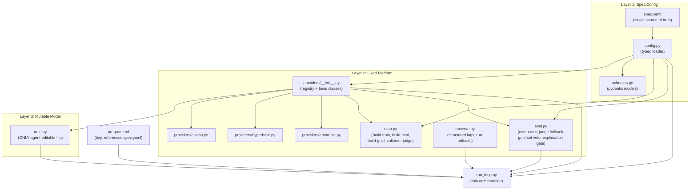

# AutoEmailTrust v3.4 Lean

Updates from v3.3: (1) providers.py split into registry + per-backend modules, (2) Kappa-proportional downweighting for poorly-calibrated axes, (3) explanation quality as a composite gate, (4) gold-set veto behavior made explicit in program.md, (5) annotation_rubric.md moved before any data generation in execution order.

## 3-Layer Architecture



## File Layout

```
autoresearch-helpful/
├── pyproject.toml
├── .env.example
├── .gitignore
├── spec.yaml                    # single source of truth
├── autotrust/
│   ├── __init__.py
│   ├── config.py                # typed settings loader
│   ├── schemas.py               # pydantic models
│   ├── providers/
│   │   ├── __init__.py          # registry, base classes, get_provider()
│   │   ├── ollama.py            # GeneratorProvider (local Dolphin 3.0)
│   │   ├── hyperbolic.py        # ScoringProvider + TrainingProvider
│   │   └── anthropic.py         # JudgeProvider (Opus primary, configurable secondary)
│   ├── data.py                  # train/eval/gold generation + calibration
│   ├── eval.py                  # fixed metrics, judge fallback, gold-set veto, explanation gate
│   └── observe.py               # logging, run artifacts
├── train.py                     # ONLY agent-editable file
├── run_loop.py                  # thin orchestration
├── program.md                   # tiny instruction set
├── annotation_rubric.md         # human scoring guidelines (written BEFORE data gen)
├── README.md
├── gold_set/
│   └── gold_chains.jsonl
├── eval_set/
│   └── eval_chains.jsonl
├── synth_data/
│   └── .gitkeep
├── runs/                        # per-experiment artifacts
│   └── .gitkeep
└── tests/
    ├── test_composite_metric.py
    ├── test_escalation_rules.py
    ├── test_safety_filter.py
    ├── test_schema_validation.py
    ├── test_gold_gate.py
    ├── test_explanation_gate.py
    ├── test_kappa_downweight.py
    ├── test_providers.py         # contract tests (per-backend)
    └── test_smoke.py             # 10-chain eval + 1 loop cycle
```

## `spec.yaml` -- Single Source of Truth

```yaml
trust_axes:
  - truthfulness
  - verify_by_search
  - manipulation
  - deceit
  - vulnerability_risk
  - subtle_toxicity
  - polarization
  - classic_email_metrics
  - authority_impersonation

composite_weights:
  phish_f1: 0.22
  truth_agreement: 0.18
  manipulation: 0.13
  deceit_recall: 0.10
  vulnerability_risk: 0.10
  subtle_toxicity: 0.08
  polarization: 0.05
  classic_email_metrics: 0.04
  authority_impersonation: 0.10
  false_positive_rate: -0.15

providers:
  generator:
    backend: local_ollama
    model: dolphin3:latest
  scorer:
    backend: hyperbolic
    model: meta-llama/Llama-3.1-8B-Instruct
  judge_primary:
    backend: anthropic
    model: claude-opus-4-20250514
  judge_secondary:
    backend: anthropic
    model: claude-sonnet-4-20250514
  trainer:
    backend: hyperbolic_gpu
    gpu_type: H100

limits:
  experiment_minutes: 15
  max_spend_usd: 8

judge:
  escalate_threshold: 0.60
  disagreement_max: 0.20
  min_gold_kappa: 0.70

calibration:
  downweight_policy: kappa_proportional   # axis weight *= actual_kappa / min_gold_kappa
  redistribute_remainder: true            # unallocated weight spread to passing axes
  log_downweighted_axes: true

explanation:
  min_quality_threshold: 0.5              # explanation must score >= 0.5 to pass gate
  gate_enabled: true                      # if false, explanation quality is logged but not gated

safety:
  synth_placeholder_only: true
  block_operational_instructions: true
  real_brands_in_eval: true

data:
  eval_set_size: 1000
  gold_set_size: 200
  synth_real_ratio: 0.7
  train_val_test_split: [0.70, 0.15, 0.15]
```

## Key Policy Decisions (v3.4)

### Keep/Discard Decision: Three Gates

An experiment is kept only if ALL three gates pass:

```
1. Composite improved?     (weighted score with FP penalty + Kappa downweighting)
2. Gold-set veto passed?   (no axis degrades vs human consensus labels)
3. Explanation gate passed? (explanation quality >= min_quality_threshold)
```

The gold-set veto has absolute authority. An experiment can improve composite by +10% but still be rejected if it degrades agreement on any single axis (e.g., subtle_toxicity). This is intentional: the composite score alone is never sufficient for keep/discard. program.md makes this explicit so the agent doesn't chase composite gains that keep getting rejected.

### Kappa-Proportional Downweighting

When `calibrate-judge` finds an axis with Kappa below `min_gold_kappa`:

- The axis is NOT excluded from composite
- Its composite weight gets multiplied by `actual_kappa / min_gold_kappa`
- Example: subtle_toxicity has Kappa 0.55, min is 0.70 -> weight becomes `0.08 * (0.55/0.70) = 0.063`
- The unallocated weight (0.08 - 0.063 = 0.017) is redistributed proportionally across passing axes
- Every experiment run logs which axes are downweighted and by how much
- The axis still participates in the gold-set veto gate (human labels are the reference, not Opus)
- Likely candidates for downweighting: polarization, subtle_toxicity

This avoids the binary "include or exclude" problem -- poorly-calibrated axes contribute less but don't disappear.

### Explanation Quality Gate

Explanation quality is computed by `eval.py` and influences keep/discard:

- Measures whether the model's explanation mentions the correct flagged axes
- Must score >= `min_quality_threshold` (default 0.5) for the experiment to be kept
- If `gate_enabled: false` in spec.yaml, it's logged but doesn't block
- This gives the agent an incentive to improve explanations, not just scores
- The gate is separate from composite -- explanation quality is not a composite weight

### Composite + FP Penalty Interaction

The `false_positive_rate: -0.15` weight in composite penalizes FP in the score, and the gold gate separately rejects axis regressions. This means an experiment could improve composite (other axes offset the FP penalty) but still be rejected by the gold gate because FP degraded on one axis. This double-check is the intended behavior -- documented in program.md.

## Implementation Details

### 1. Scaffold

- **`pyproject.toml`**: Python 3.12, uv-managed. Dependencies:
  - `anthropic`, `openai` (Hyperbolic uses OpenAI-compatible endpoint), `ollama`
  - `python-dotenv`, `pydantic`, `pyyaml`
  - `gitpython`, `httpx`, `rich`, `structlog`
  - `datasets`, `scikit-learn`
  - Dev: `pytest`, `ruff`
- **`.env.example`**: `ANTHROPIC_API_KEY=`, `HYPERBOLIC_API_KEY=`, `OLLAMA_MODEL=dolphin3:latest`
- **`.gitignore`**: `.env`, `synth_data/*.jsonl`, `runs/`, `__pycache__/`, `.venv/`

### 2. `annotation_rubric.md` -- Human Scoring Guidelines

Written BEFORE any data generation. Defines the semantics of every axis:

- Per-axis definitions with concrete examples at 0.0, 0.5, and 1.0
- Binary axis criteria (phish: what makes it 0 vs 1; verify_by_search: when to flag)
- Continuous axis boundary conditions (e.g., legitimate urgency vs manipulative urgency for manipulation; friendly authority vs impersonation for authority_impersonation)
- Edge case guidance (multi-intent emails, sarcasm, cultural context)
- Instructions for annotators: score independently, document uncertainty, flag ambiguous chains

### 3. `config.py` -- Typed Settings Loader

- `load_spec(path="spec.yaml") -> Spec` -- loads and validates into pydantic model
- `get_spec() -> Spec` -- cached singleton
- Validates: provider bindings exist, positive weights sum correctly, axis names consistent, calibration policy valid
- Loads Kappa calibration data if `gold_set/calibration.json` exists (output of `calibrate-judge`)
- `get_effective_weights(spec, calibration) -> dict` -- applies Kappa-proportional downweighting and redistribution

### 4. `schemas.py` -- Pydantic Models

- `Email` -- single message (from, to, subject, body, timestamp, reply_depth)
- `EmailChain` -- chain with metadata, labels (9 axes), trust_vector, composite, flags
- `TrustVector` -- 9-dim, axes dynamically built from spec.yaml
- `ExperimentResult` -- run_id, change_description, per_axis_scores, composite, fp_rate, judge_agreement, gold_agreement, explanation_quality, downweighted_axes, cost, wall_time
- `RunArtifacts` -- paths to metrics.json, predictions.jsonl, config.json, summary.txt
- `GoldChain` -- extends EmailChain with annotator_scores, consensus_labels, kappa, opus_agreement
- `CalibrationReport` -- per-axis Kappa, effective weights after downweighting, flagged axes

### 5. `providers/` -- Registry + Per-Backend Modules

**`providers/__init__.py`** -- registry and base classes:

```python
class GeneratorProvider(ABC):
    generate(prompt, ...) -> str
    generate_batch(prompts, concurrency=4) -> list[str]
    check_available() -> bool

class ScoringProvider(ABC):
    score(prompt, ...) -> str
    score_batch(prompts, ...) -> list[str]

class JudgeProvider(ABC):
    judge(chain, axes) -> dict
    dual_judge(chain) -> tuple[dict, dict, float]

class TrainingProvider(ABC):
    list_gpus() -> list
    rent_gpu(hours, name) -> str
    stop_gpu(instance_id) -> None
    get_status(instance_id) -> dict
    run_remote(instance_id, command) -> str
    budget_guard(max_usd) -> ContextManager
    yarn_extend_context(base_model, target_ctx, steps) -> str

def get_provider(role: str, spec: Spec) -> Provider
```

Shared base class handles: retry logic, structured logging, error normalization.

**`providers/ollama.py`** -- `OllamaGenerator(GeneratorProvider)`:
- Uses `ollama` Python package
- `check_available()` verifies daemon running + model pulled
- MLX fallback option for Apple Silicon

**`providers/hyperbolic.py`** -- `HyperbolicScorer(ScoringProvider)` + `HyperbolicTrainer(TrainingProvider)`:
- Scorer uses `openai.OpenAI(base_url="https://api.hyperbolic.xyz/v1", api_key=...)`
- Trainer uses `httpx` for Marketplace API (rent/stop/status/ssh)
- `BudgetGuard` context manager tracks spend, auto-terminates at limit
- `yarn_extend_context()` generates training config for YaRN on rented GPU

**`providers/anthropic.py`** -- `AnthropicJudge(JudgeProvider)`:
- Uses `anthropic.Anthropic` client directly
- `judge()` calls primary model (Opus) with bias-mitigated prompt (position randomization, verbosity normalization)
- `dual_judge()` calls primary then secondary, runs disagreement filter
- Primary and secondary models configurable via spec.yaml

### 6. `data.py` -- Fixed Data Module

All dataset behavior, invoked as subcommands:

```bash
uv run python -m autotrust.data build-train --count 5000
uv run python -m autotrust.data build-eval
uv run python -m autotrust.data build-gold
uv run python -m autotrust.data annotate-export
uv run python -m autotrust.data calibrate-judge
```

Internally:
- Real corpora: SpamAssassin + Enron (real brands preserved)
- Synthetic: Dolphin 3.0 via GeneratorProvider (placeholders only, no operational instructions)
- Pipeline: seed -> safety filter -> Evol-Instruct -> SpearBot critic -> dual-judge labeling -> dedup
- `calibrate-judge`: ingests human annotations, computes Cohen's Kappa per axis, writes `gold_set/calibration.json`, logs which axes fall below min_gold_kappa

### 7. `eval.py` -- Fixed Evaluation Policy

```python
def compute_composite(per_axis: dict, spec: Spec, calibration: CalibrationReport) -> float:
    """Weighted sum using Kappa-adjusted weights. Logs downweighted axes."""

def gold_regression_gate(predictions, gold_set, previous_best, spec: Spec) -> tuple[bool, dict]:
    """Returns (passed, per_axis_delta). Veto if ANY axis degrades."""

def explanation_quality_gate(explanations, ground_truth_axes, spec: Spec) -> tuple[bool, float]:
    """Returns (passed, score). Gate if spec.explanation.gate_enabled and score < threshold."""

def keep_or_discard(composite_improved: bool, gold_ok: bool, explanation_ok: bool) -> bool:
    """All three must pass."""

def score_predictions(predictions, ground_truth, spec) -> dict
def run_judge_fallback(chain, fast_scores, judge, spec) -> dict
```

### 8. `observe.py` -- Structured Logging + Run Artifacts

- `structlog` with JSON output
- `start_run(spec) -> RunContext` -- creates `runs/<run_id>/`, snapshots config + effective weights
- `log_experiment(ctx, result)` -- writes metrics.json, includes downweighted_axes and gate results
- `log_predictions(ctx, predictions)` -- predictions.jsonl
- `finalize_run(ctx)` -- summary.txt
- Calibration warnings: logs when axes are downweighted, how much weight was redistributed

### 9. `train.py` -- The Only Mutable File

- `EmailTrustScorer` with `score_chain()`, `score_batch()`, `explain()`
- Baseline: thread-aware prompt via ScoringProvider asking about inter-message patterns
- Thread encoder signals: reply timing, escalation, authority shifts, persuasion progression
- Explanation output: structured reasons extracted from chain-of-thought
- LoRA scaffolding: `fine_tune()` and `load_fine_tuned()` as placeholders
- Uses providers -- never constructs clients directly

### 10. `run_loop.py` -- Thin Orchestration

```python
spec = get_spec()
calibration = load_calibration()  # Kappa data from gold-set step
run_ctx = start_run(spec)

while experiment_count < max_experiments:
    # 1. Call Sonnet with program.md + train.py + last N results
    # 2. Apply proposed edit to train.py
    # 3. predictions = score all eval chains via train.py
    # 4. metrics = eval.score_predictions(predictions, ground_truth, spec)
    # 5. composite = eval.compute_composite(metrics, spec, calibration)
    # 6. gold_ok, gold_deltas = eval.gold_regression_gate(predictions, gold_set, prev_best, spec)
    # 7. expl_ok, expl_score = eval.explanation_quality_gate(explanations, truth_axes, spec)
    # 8. keep = eval.keep_or_discard(composite > prev_best, gold_ok, expl_ok)
    # 9. if keep: git commit, else: git checkout -- train.py
    # 10. observe.log_experiment(run_ctx, result)
    # 11. if 3 consecutive no-improvement: nudge toward LoRA
    # 12. enforce budget/time from spec.limits
```

### 11. `program.md` -- Tiny Instruction Set

```
You are optimizing a content-only email trust scorer.

Rules:
- Only edit train.py
- Budget: see spec.yaml limits (currently 15 min / $8)
- Base model: see spec.yaml providers.scorer (currently Llama-3.1-8B on Hyperbolic)

Keep/discard has THREE gates (all must pass):
1. Composite score must improve (includes FP penalty and Kappa-adjusted weights)
2. Gold-set veto: no axis may degrade vs human consensus labels
3. Explanation gate: explanation quality must be >= 0.5

The gold-set veto has absolute authority. An experiment that improves composite
by +10% will still be rejected if it degrades any single axis. Do not chase
composite improvements that ignore per-axis quality.

Trust axes, composite weights, and thresholds are in spec.yaml. Do not change them.

Priorities:
1. Thread encoder: per-email embeddings -> attention over thread -> chain classifier
2. Multi-task heads for solved axes (phish, manipulation, classic, authority_impersonation)
3. Explanation output: structured reasons why email is suspicious (this is gated!)
4. When gains stall: LoRA fine-tune via TrainingProvider (auto-terminate GPUs)

Start now.
```

## Test Strategy

Platform code is heavily tested (TDD). `train.py` is lightly smoke-tested.

**Unit tests:**
- `test_composite_metric.py` -- formula matches spec weights, FP penalty works
- `test_kappa_downweight.py` -- Kappa-proportional downweighting + redistribution math is correct
- `test_escalation_rules.py` -- judge fallback triggers at threshold
- `test_safety_filter.py` -- rejects operational instructions, allows structural malicious
- `test_schema_validation.py` -- all models round-trip correctly
- `test_gold_gate.py` -- rejects axis regressions, accepts genuine improvements, veto overrides composite
- `test_explanation_gate.py` -- blocks below threshold, passes above, respects gate_enabled flag

**Contract tests (`test_providers.py`):**
- Mock/fixture-based per provider interface
- OllamaGenerator: returns well-formed text, handles batch, check_available works
- HyperbolicScorer: returns parseable scores, handles retry
- HyperbolicTrainer: rent/stop lifecycle, budget guard triggers at limit
- AnthropicJudge: returns per-axis scores, dual_judge returns agreement, bias mitigations applied

**Smoke tests (`test_smoke.py`):**
- Tiny eval set (10 chains), tiny gold set (10 chains)
- One full loop cycle with dummy `train.py` returning fixed scores
- Verifies three-gate keep/discard works end-to-end
- Verifies explanation gate blocks when quality is low

**Regression tests (frozen data):**
- Gold-set agreement checks against committed gold_chains.jsonl
- False-positive test slice
- Explanation format validation

## Execution Order

1. **Scaffold**: pyproject.toml, .env.example, .gitignore, spec.yaml
2. **annotation_rubric.md** (BEFORE any data gen -- defines axis semantics)
3. **Core platform**: config.py, schemas.py, providers/ (registry + ollama.py, hyperbolic.py, anthropic.py)
4. **Unit + contract tests** for core platform (TDD)
5. **data.py + eval.py** (data module + evaluation policy with all three gates)
6. **Unit tests** for data/eval (composite, downweighting, escalation, safety, gold gate, explanation gate)
7. **observe.py** (structured logging, run artifacts)
8. Generate gold-set candidates: `uv run python -m autotrust.data build-gold`
9. **HUMAN STEP**: annotate 200 chains, run `calibrate-judge`, review Kappa per axis
10. **train.py** baseline scorer
11. **program.md** (tiny, explains three-gate policy)
12. **run_loop.py** (thin orchestration)
13. **Smoke tests** (10-chain eval, 1 loop cycle, three-gate verification)
14. Generate eval_set: `uv run python -m autotrust.data build-eval`
15. Update README.md
